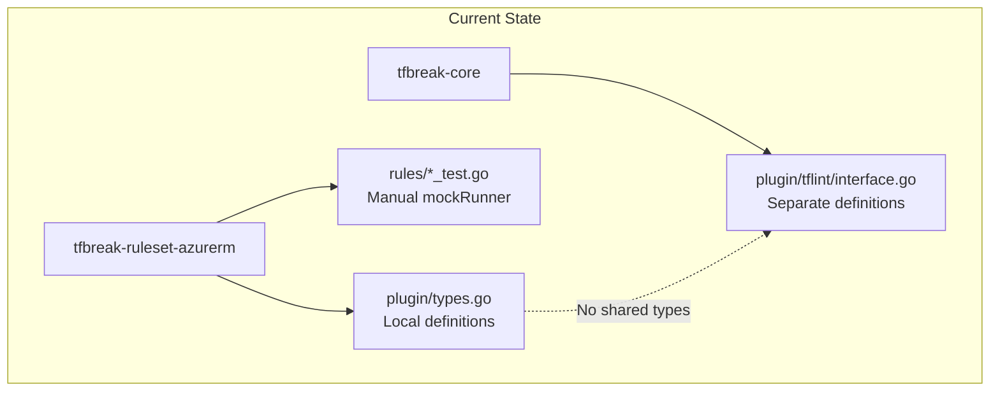
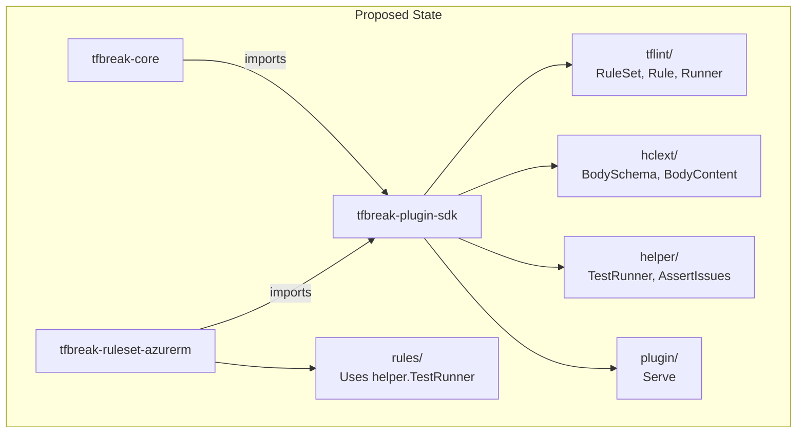
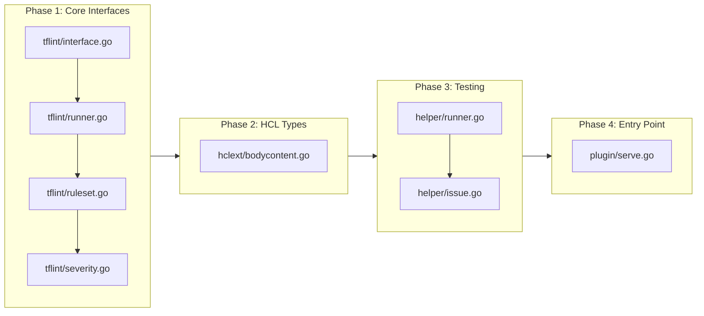

# Minimum Viable Plugin SDK for tfbreak-ruleset-azurerm

## Change Summary

Create the minimum viable tfbreak-plugin-sdk that enables tfbreak-ruleset-azurerm to be developed and tested independently. The SDK provides tflint-aligned interfaces (RuleSet, Rule, Runner, Severity), HCL schema types (hclext), testing utilities (helper.TestRunner), and a plugin entry point (plugin.Serve).

## Motivation and Background

tfbreak-ruleset-azurerm currently defines its own local plugin types in `plugin/types.go`. This creates duplication and prevents proper integration with tfbreak-core. A shared SDK allows:

1. tfbreak-ruleset-azurerm to develop rules against stable interfaces
2. Unit testing without requiring tfbreak-core
3. Future gRPC integration when tfbreak-core implements plugin loading
4. Consistent patterns across multiple future provider rulesets

The SDK design is aligned with tflint-plugin-sdk to leverage ecosystem familiarity while accommodating tfbreak's dual-config (old/new) comparison model.

## Change Drivers

* tfbreak-ruleset-azurerm needs stable interfaces to develop against
* Plugin testing must work without tfbreak-core installed
* Ecosystem familiarity reduces learning curve for plugin authors
* Shared SDK prevents code duplication across rulesets

## Current State

tfbreak-ruleset-azurerm currently has local type definitions:

```
tfbreak-ruleset-azurerm/
├── plugin/
│   └── types.go          # Local Rule, Runner, RuleSet, Severity definitions
├── rules/
│   └── azurerm_force_new_test.go  # Uses local mockRunner
```

The local `plugin/types.go` defines:
- `Severity` (ERROR, WARNING, NOTICE)
- `Rule` interface
- `Runner` interface (GetOldModuleContent, GetNewModuleContent, EmitIssue)
- `RuleSet` interface
- `BuiltinRuleSet` struct
- `ServeOpts` and `Serve()` stub

Testing uses a manual `mockRunner` implementation in each test file.

### Current State Diagram



## Proposed Change

Create tfbreak-plugin-sdk as a standalone Go module providing:

1. **tflint package**: Core interfaces (RuleSet, Rule, Runner, Severity)
2. **hclext package**: HCL schema and content types
3. **helper package**: TestRunner and assertion utilities
4. **plugin package**: Serve() entry point

tfbreak-ruleset-azurerm will import the SDK and remove local type definitions.

### Proposed State Diagram



## Requirements

### Functional Requirements

1. The SDK **MUST** provide a `tflint.RuleSet` interface with methods: `RuleSetName()`, `RuleSetVersion()`, `RuleNames()`, `VersionConstraint()`
2. The SDK **MUST** provide a `tflint.Rule` interface with methods: `Name()`, `Enabled()`, `Severity()`, `Link()`, `Check(Runner) error`
3. The SDK **MUST** provide a `tflint.Runner` interface with dual-config methods: `GetOldResourceContent()`, `GetNewResourceContent()`, `EmitIssue()`
4. The SDK **MUST** provide `tflint.Severity` constants: `ERROR`, `WARNING`, `NOTICE`
5. The SDK **MUST** provide `tflint.BuiltinRuleSet` for embedding with default implementations
6. The SDK **MUST** provide `tflint.DefaultRule` for embedding with default `Enabled()` and `Severity()` implementations
7. The SDK **MUST** provide `hclext.BodySchema` and `hclext.BodyContent` types compatible with HCL v2
8. The SDK **MUST** provide `helper.TestRunner(t, oldFiles, newFiles)` for testing rules in isolation
9. The SDK **MUST** provide `helper.AssertIssues(t, want, got)` for comparing expected vs actual issues
10. The SDK **MUST** provide `plugin.Serve(opts *ServeOpts)` as the plugin entry point
11. The SDK **MUST** compile independently with `go build ./...`
12. The SDK **MUST** have zero external dependencies beyond `github.com/hashicorp/hcl/v2` and `github.com/google/go-cmp`

### Non-Functional Requirements

1. The SDK **MUST** maintain tflint-plugin-sdk interface naming conventions for ecosystem familiarity
2. The SDK **MUST** document all public types and functions with GoDoc comments
3. The SDK **MUST** pass `go vet ./...` with no issues
4. The SDK **MUST** achieve test coverage for helper package utilities

## Affected Components

* `tfbreak-plugin-sdk/tflint/` - New package with core interfaces
* `tfbreak-plugin-sdk/hclext/` - New package with HCL types
* `tfbreak-plugin-sdk/helper/` - New package with testing utilities
* `tfbreak-plugin-sdk/plugin/` - New package with entry point
* `tfbreak-ruleset-azurerm/plugin/` - Will be deleted (replaced by SDK import)
* `tfbreak-ruleset-azurerm/rules/*_test.go` - Will use helper.TestRunner
* `tfbreak-ruleset-azurerm/go.mod` - Will add SDK dependency

## Scope Boundaries

### In Scope

* Core interfaces: RuleSet, Rule, Runner, Severity
* HCL types: BodySchema, BodyContent, Attribute, Block
* Testing: TestRunner, Issue, AssertIssues, AssertIssuesWithoutRange
* Entry point: plugin.Serve()
* Documentation: GoDoc comments for all public APIs

### Out of Scope ("Here, But Not Further")

* gRPC infrastructure - Deferred to CR-0002 when tfbreak-core plugin loading is ready
* Expression evaluation (`EvaluateExpr`) - Not needed for static config comparison
* Autofix support (`Fixer`, `EmitIssueWithFix`) - Not relevant for breaking change detection
* Module expansion - tfbreak works with flat configurations
* Provider content methods - Not needed for current use cases
* Dynamic block expansion - tfbreak compares configs as-written
* Protocol buffer definitions - Deferred to gRPC CR

## Alternative Approaches Considered

* **Vendor tflint-plugin-sdk**: Rejected due to unnecessary complexity and single-config assumption
* **No SDK (keep local types)**: Rejected due to duplication and integration challenges
* **Generic interface (not tflint-aligned)**: Rejected due to ecosystem unfamiliarity

## Impact Assessment

### User Impact

Plugin authors (tfbreak-ruleset-* maintainers) will:
- Import the SDK instead of defining local types
- Use familiar tflint-style interfaces
- Gain access to TestRunner for easier testing

### Technical Impact

* tfbreak-ruleset-azurerm **MUST** update imports and remove local plugin/types.go
* tfbreak-core **MUST** import SDK types for plugin integration (future CR)
* No breaking changes to external APIs

### Business Impact

* Enables faster plugin development with stable interfaces
* Reduces maintenance burden through shared code
* Aligns with Terraform ecosystem conventions

## Implementation Approach

### Phase 1: Core Interfaces

Create the tflint package with core interfaces:

```
tfbreak-plugin-sdk/
├── tflint/
│   ├── interface.go    # RuleSet, Rule interfaces
│   ├── runner.go       # Runner interface (dual-config)
│   ├── ruleset.go      # BuiltinRuleSet, DefaultRule
│   ├── severity.go     # ERROR, WARNING, NOTICE
│   └── severity_test.go
```

### Phase 2: HCL Types

Create the hclext package with schema types:

```
tfbreak-plugin-sdk/
├── hclext/
│   ├── bodycontent.go  # BodySchema, BodyContent, Attribute, Block
│   └── bodycontent_test.go
```

### Phase 3: Testing Utilities

Create the helper package:

```
tfbreak-plugin-sdk/
├── helper/
│   ├── runner.go       # TestRunner implementation
│   ├── runner_test.go
│   ├── issue.go        # Issue struct, AssertIssues
│   └── issue_test.go
```

### Phase 4: Entry Point

Create the plugin package:

```
tfbreak-plugin-sdk/
├── plugin/
│   └── serve.go        # Serve(), ServeOpts
```

### Implementation Flow



## Test Strategy

### Tests to Add

| Test File | Test Name | Description | Inputs | Expected Output |
|-----------|-----------|-------------|--------|-----------------|
| `tflint/severity_test.go` | `TestSeverity_String` | Verify severity string representations | ERROR, WARNING, NOTICE | "ERROR", "WARNING", "NOTICE" |
| `tflint/ruleset_test.go` | `TestBuiltinRuleSet_RuleNames` | Verify RuleNames returns all rule names | RuleSet with 3 rules | []string with 3 names |
| `tflint/ruleset_test.go` | `TestBuiltinRuleSet_IsRuleEnabled` | Verify enabled state tracking | Rules with mixed enabled state | Correct enabled flags |
| `tflint/ruleset_test.go` | `TestDefaultRule_Enabled` | Verify DefaultRule returns true | DefaultRule{} | true |
| `tflint/ruleset_test.go` | `TestDefaultRule_Severity` | Verify DefaultRule returns ERROR | DefaultRule{} | ERROR |
| `hclext/bodycontent_test.go` | `TestBodySchema_ToHCL` | Verify schema conversion | BodySchema with attrs/blocks | Valid hcl.BodySchema |
| `helper/runner_test.go` | `TestTestRunner_GetOldResourceContent` | Verify old config access | Old HCL with resource | Parsed resource content |
| `helper/runner_test.go` | `TestTestRunner_GetNewResourceContent` | Verify new config access | New HCL with resource | Parsed resource content |
| `helper/runner_test.go` | `TestTestRunner_EmitIssue` | Verify issue collection | Rule, message, range | Issue in runner.Issues |
| `helper/issue_test.go` | `TestAssertIssues_Match` | Verify matching issues pass | Same issues | No test failure |
| `helper/issue_test.go` | `TestAssertIssues_Mismatch` | Verify mismatched issues fail | Different issues | Test failure |
| `helper/issue_test.go` | `TestAssertIssuesWithoutRange` | Verify range ignored | Issues with different ranges | No test failure |

### Tests to Modify

Not applicable - this is a new package.

### Tests to Remove

Not applicable - this is a new package.

## Acceptance Criteria

### AC-1: RuleSet interface is complete

```gherkin
Given the tfbreak-plugin-sdk is imported
When a plugin implements tflint.RuleSet
Then it MUST provide RuleSetName(), RuleSetVersion(), RuleNames(), VersionConstraint() methods
```

### AC-2: Rule interface is complete

```gherkin
Given the tfbreak-plugin-sdk is imported
When a plugin implements tflint.Rule
Then it MUST provide Name(), Enabled(), Severity(), Link(), Check(Runner) error methods
```

### AC-3: Runner provides dual-config access

```gherkin
Given a tflint.Runner instance
When a rule calls GetOldResourceContent() and GetNewResourceContent()
Then it receives parsed content from the old and new configurations respectively
```

### AC-4: Severity constants are available

```gherkin
Given the tfbreak-plugin-sdk is imported
When a rule uses tflint.ERROR, tflint.WARNING, or tflint.NOTICE
Then these constants are available with correct int values (1, 2, 3)
```

### AC-5: BuiltinRuleSet provides defaults

```gherkin
Given a custom RuleSet embeds tflint.BuiltinRuleSet
When the custom RuleSet does not override a method
Then the BuiltinRuleSet default implementation is used
```

### AC-6: TestRunner parses dual configs

```gherkin
Given old files map[string]string and new files map[string]string
When helper.TestRunner(t, oldFiles, newFiles) is called
Then the returned runner provides access to both configurations
```

### AC-7: AssertIssues compares correctly

```gherkin
Given expected []helper.Issue and actual []helper.Issue
When helper.AssertIssues(t, expected, actual) is called
Then the test passes if issues match (ignoring order and byte positions)
  And the test fails with descriptive diff if issues don't match
```

### AC-8: plugin.Serve is available

```gherkin
Given a plugin with a RuleSet implementation
When the plugin calls plugin.Serve(&plugin.ServeOpts{RuleSet: myRuleSet})
Then the plugin starts and waits for host communication
```

### AC-9: SDK builds independently

```gherkin
Given the tfbreak-plugin-sdk repository
When go build ./... is executed
Then the build succeeds with no errors
```

### AC-10: tfbreak-ruleset-azurerm can import SDK

```gherkin
Given tfbreak-ruleset-azurerm with SDK import
When the local plugin/types.go is deleted
  And imports are changed to github.com/jokarl/tfbreak-plugin-sdk/tflint
Then the plugin compiles successfully
  And all tests pass using helper.TestRunner
```

## Quality Standards Compliance

### Build & Compilation

- [ ] Code compiles/builds without errors
- [ ] No new compiler warnings introduced

### Linting & Code Style

- [ ] All linter checks pass with zero warnings/errors
- [ ] Code follows project coding conventions and style guides
- [ ] Any linter exceptions are documented with justification

### Test Execution

- [ ] All existing tests pass after implementation
- [ ] All new tests pass
- [ ] Test coverage meets project requirements for changed code

### Documentation

- [ ] Inline code documentation updated where applicable
- [ ] API documentation updated for any API changes
- [ ] User-facing documentation updated if behavior changes

### Code Review

- [ ] Changes submitted via pull request
- [ ] PR title follows Conventional Commits format
- [ ] Code review completed and approved
- [ ] Changes squash-merged to maintain linear history

### Verification Commands

```bash
# Build verification
go build ./...

# Lint verification
go vet ./...

# Test execution
go test -race -v ./...

# Test coverage
go test -coverprofile=coverage.out ./...
go tool cover -func=coverage.out
```

## Risks and Mitigation

### Risk 1: Interface changes break tfbreak-ruleset-azurerm

**Likelihood:** Medium
**Impact:** High
**Mitigation:** Define interfaces carefully upfront; use semantic versioning; coordinate releases with tfbreak-ruleset-azurerm updates

### Risk 2: Testing utilities insufficient for complex rules

**Likelihood:** Low
**Impact:** Medium
**Mitigation:** Design TestRunner to be extensible; add capabilities iteratively based on real rule needs

### Risk 3: tflint alignment creates confusion

**Likelihood:** Low
**Impact:** Low
**Mitigation:** Document deviations clearly in ADR-0001; use identical names only where semantics match

## Dependencies

* ADR-0001 (tflint-Aligned Plugin SDK Architecture) - Documents design decisions
* github.com/hashicorp/hcl/v2 - HCL parsing library
* github.com/google/go-cmp - Testing comparisons

## Estimated Effort

| Phase | Description | Effort |
|-------|-------------|--------|
| Phase 1 | Core interfaces (tflint/) | 2-3 hours |
| Phase 2 | HCL types (hclext/) | 1-2 hours |
| Phase 3 | Testing utilities (helper/) | 3-4 hours |
| Phase 4 | Entry point (plugin/) | 1 hour |
| Integration | Update tfbreak-ruleset-azurerm | 1-2 hours |
| **Total** | | **8-12 hours** |

## Decision Outcome

Chosen approach: "tflint-aligned SDK with dual-config Runner", because it provides ecosystem familiarity while accommodating tfbreak's unique comparison model.

## Related Items

* Architecture decisions: ADR-0001-tflint-aligned-plugin-sdk.md
* Downstream consumer: tfbreak-ruleset-azurerm
* Future integration: tfbreak-core plugin infrastructure

## More Information

### Interface Reference (from tflint-plugin-sdk research)

The SDK interfaces are derived from extensive research of tflint-plugin-sdk via DeepWiki:

**RuleSet interface** (tflint-aligned):
- `RuleSetName() string` - Plugin name
- `RuleSetVersion() string` - Plugin version
- `RuleNames() []string` - List of rule names
- `VersionConstraint() string` - Host version constraint
- `ConfigSchema() *hclext.BodySchema` - Plugin config schema (optional)
- `ApplyGlobalConfig(*Config) error` - Apply global config
- `ApplyConfig(*hclext.BodyContent) error` - Apply plugin config
- `NewRunner(Runner) (Runner, error)` - Wrap runner (optional)

**Rule interface** (tflint-aligned):
- `Name() string` - Rule name
- `Enabled() bool` - Default enabled state
- `Severity() Severity` - Default severity
- `Link() string` - Documentation URL
- `Check(Runner) error` - Execute rule

**Runner interface** (tfbreak deviation):
- `GetOldResourceContent(resourceType string, schema *hclext.BodySchema, opts *GetModuleContentOption) (*hclext.BodyContent, error)`
- `GetNewResourceContent(resourceType string, schema *hclext.BodySchema, opts *GetModuleContentOption) (*hclext.BodyContent, error)`
- `EmitIssue(rule Rule, message string, issueRange hcl.Range) error`
- `DecodeRuleConfig(ruleName string, ret any) error`

### File Structure

```
tfbreak-plugin-sdk/
├── go.mod
├── go.sum
├── tflint/
│   ├── interface.go      # RuleSet, Rule interfaces
│   ├── runner.go         # Runner interface
│   ├── ruleset.go        # BuiltinRuleSet, DefaultRule
│   ├── ruleset_test.go
│   ├── severity.go       # Severity type and constants
│   └── severity_test.go
├── hclext/
│   ├── bodycontent.go    # BodySchema, BodyContent, etc.
│   └── bodycontent_test.go
├── helper/
│   ├── runner.go         # TestRunner implementation
│   ├── runner_test.go
│   ├── issue.go          # Issue struct, assertions
│   └── issue_test.go
├── plugin/
│   └── serve.go          # Serve(), ServeOpts
└── docs/
    ├── adr/
    │   └── ADR-0001-tflint-aligned-plugin-sdk.md
    └── cr/
        └── CR-0001-minimum-viable-sdk.md
```
