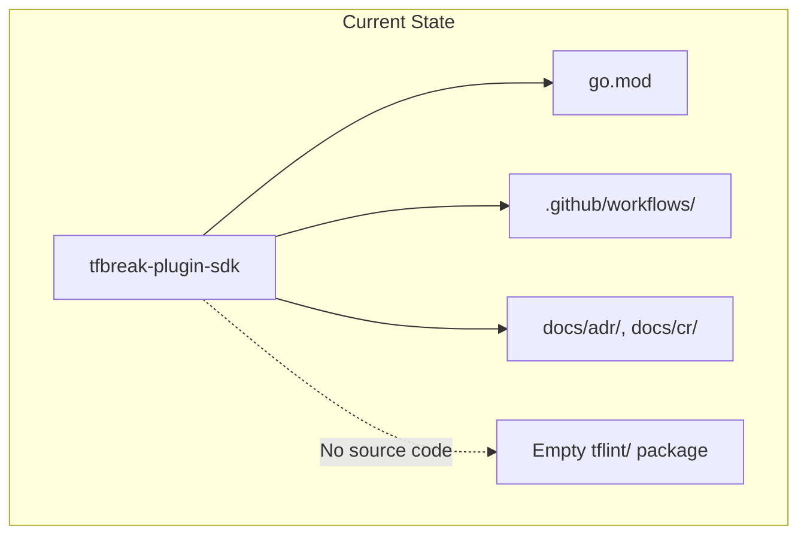
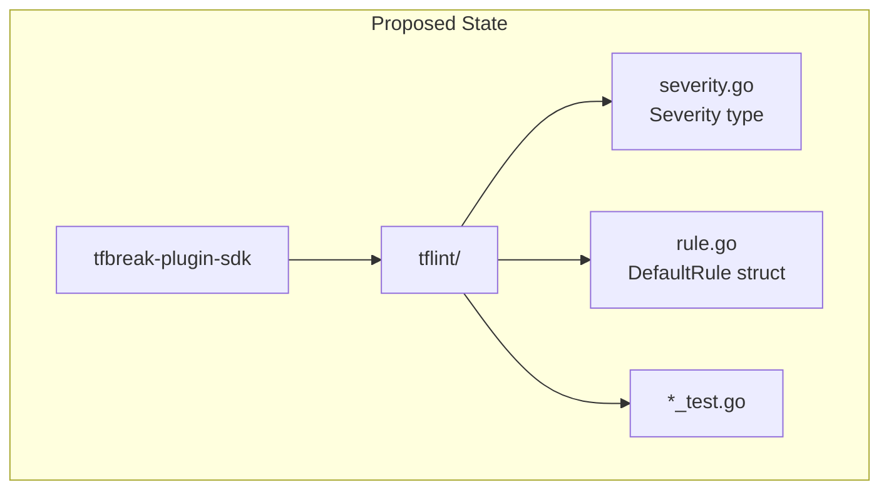

# Core Types: Severity and DefaultRule

## Change Summary

Implement the foundational types for tfbreak-plugin-sdk: the `Severity` type with constants (ERROR, WARNING, NOTICE) and the `DefaultRule` struct for embedding. These types have no dependencies on other SDK packages and form the foundation for all subsequent CRs.

## Motivation and Background

The Severity type and DefaultRule struct are the most fundamental building blocks of the SDK. They are referenced by the Rule interface (CR-0004) and used throughout plugin implementations. Implementing them first allows:

1. Early validation of the tflint-aligned naming convention
2. A working, testable package from the first CR
3. Clear dependency ordering for subsequent CRs

Per ADR-0001, severity levels align exactly with tflint-plugin-sdk: ERROR, WARNING, NOTICE.

## Change Drivers

* Establishes tflint-aligned naming convention early
* Provides foundation for Rule interface (CR-0004)
* Enables incremental, testable development
* Zero dependencies on other SDK packages

## Current State

The tfbreak-plugin-sdk repository exists with:
- `go.mod` initialized
- CI/CD workflows configured
- ADR-0001 and CR-0001 documenting the architecture

No source code exists yet.

### Current State Diagram



## Proposed Change

Create the `tflint/` package with:
1. `severity.go` - Severity type and constants
2. `severity_test.go` - Tests for Severity
3. `rule.go` - DefaultRule struct for embedding
4. `rule_test.go` - Tests for DefaultRule

### Proposed State Diagram



## Requirements

### Functional Requirements

1. The SDK **MUST** define `type Severity int` in `tflint/severity.go`
2. The SDK **MUST** define constants `ERROR`, `WARNING`, `NOTICE` with values 1, 2, 3 respectively
3. The SDK **MUST** implement `func (s Severity) String() string` returning "ERROR", "WARNING", "NOTICE"
4. The SDK **MUST** define `type DefaultRule struct{}` in `tflint/rule.go`
5. The SDK **MUST** implement `func (r DefaultRule) Enabled() bool` returning `true`
6. The SDK **MUST** implement `func (r DefaultRule) Severity() Severity` returning `ERROR`
7. The SDK **MUST** include GoDoc comments for all exported types and functions

### Non-Functional Requirements

1. The package **MUST** compile with `go build ./...`
2. The package **MUST** pass `go vet ./...`
3. All tests **MUST** pass with `go test -race ./...`

## Affected Components

* `tfbreak-plugin-sdk/tflint/severity.go` - New file
* `tfbreak-plugin-sdk/tflint/severity_test.go` - New file
* `tfbreak-plugin-sdk/tflint/rule.go` - New file
* `tfbreak-plugin-sdk/tflint/rule_test.go` - New file

## Scope Boundaries

### In Scope

* Severity type definition and constants
* Severity.String() method
* DefaultRule struct
* DefaultRule.Enabled() method
* DefaultRule.Severity() method
* Unit tests for all above

### Out of Scope ("Here, But Not Further")

* Rule interface - Deferred to CR-0004
* Runner interface - Deferred to CR-0004
* RuleSet interface - Deferred to CR-0005
* BuiltinRuleSet - Deferred to CR-0005
* Any HCL types - Deferred to CR-0003

## Impact Assessment

### User Impact

None - this is internal SDK development with no external consumers yet.

### Technical Impact

* Creates the first compilable source code in the SDK
* Establishes package structure and naming conventions
* No breaking changes (new code)

### Business Impact

* Enables progress on subsequent CRs
* Demonstrates incremental delivery approach

## Implementation Approach

### File: tflint/severity.go

```go
// Package tflint provides tflint-aligned interfaces for tfbreak plugins.
package tflint

// Severity represents the severity level of an issue.
// Values align with tflint-plugin-sdk for ecosystem familiarity.
type Severity int

const (
    // ERROR indicates a critical issue (e.g., breaking change causing recreation).
    ERROR Severity = iota + 1
    // WARNING indicates a potential issue that may need attention.
    WARNING
    // NOTICE indicates an informational finding.
    NOTICE
)

// String returns the string representation of the severity.
func (s Severity) String() string {
    switch s {
    case ERROR:
        return "ERROR"
    case WARNING:
        return "WARNING"
    case NOTICE:
        return "NOTICE"
    default:
        return "UNKNOWN"
    }
}
```

### File: tflint/rule.go

```go
package tflint

// DefaultRule provides default implementations for optional Rule interface methods.
// Plugin authors can embed this struct in their rule implementations.
//
// Example:
//
//	type MyRule struct {
//	    tflint.DefaultRule
//	}
//
//	func (r *MyRule) Name() string { return "my_rule" }
//	func (r *MyRule) Link() string { return "https://example.com/my_rule" }
//	func (r *MyRule) Check(runner Runner) error { ... }
type DefaultRule struct{}

// Enabled returns true, indicating rules are enabled by default.
func (r DefaultRule) Enabled() bool {
    return true
}

// Severity returns ERROR, the default severity for rules.
func (r DefaultRule) Severity() Severity {
    return ERROR
}
```

## Test Strategy

### Tests to Add

| Test File | Test Name | Description | Inputs | Expected Output |
|-----------|-----------|-------------|--------|-----------------|
| `tflint/severity_test.go` | `TestSeverity_Values` | Verify severity constant values | ERROR, WARNING, NOTICE | 1, 2, 3 |
| `tflint/severity_test.go` | `TestSeverity_String_ERROR` | Verify ERROR string | ERROR | "ERROR" |
| `tflint/severity_test.go` | `TestSeverity_String_WARNING` | Verify WARNING string | WARNING | "WARNING" |
| `tflint/severity_test.go` | `TestSeverity_String_NOTICE` | Verify NOTICE string | NOTICE | "NOTICE" |
| `tflint/severity_test.go` | `TestSeverity_String_Unknown` | Verify unknown severity | Severity(99) | "UNKNOWN" |
| `tflint/rule_test.go` | `TestDefaultRule_Enabled` | Verify default enabled | DefaultRule{} | true |
| `tflint/rule_test.go` | `TestDefaultRule_Severity` | Verify default severity | DefaultRule{} | ERROR |

### Tests to Modify

Not applicable - new package.

### Tests to Remove

Not applicable - new package.

## Acceptance Criteria

### AC-1: Severity constants have correct values

```gherkin
Given the tflint package is imported
When accessing ERROR, WARNING, NOTICE constants
Then ERROR equals 1
  And WARNING equals 2
  And NOTICE equals 3
```

### AC-2: Severity.String() returns correct strings

```gherkin
Given a Severity value
When String() is called
Then ERROR returns "ERROR"
  And WARNING returns "WARNING"
  And NOTICE returns "NOTICE"
  And unknown values return "UNKNOWN"
```

### AC-3: DefaultRule.Enabled() returns true

```gherkin
Given a DefaultRule instance
When Enabled() is called
Then it returns true
```

### AC-4: DefaultRule.Severity() returns ERROR

```gherkin
Given a DefaultRule instance
When Severity() is called
Then it returns ERROR
```

### AC-5: Package compiles and tests pass

```gherkin
Given the tflint package source code
When go build ./... is executed
Then the build succeeds
When go test -race ./... is executed
Then all tests pass
```

## Quality Standards Compliance

### Build & Compilation

- [ ] Code compiles/builds without errors
- [ ] No new compiler warnings introduced

### Linting & Code Style

- [ ] All linter checks pass with zero warnings/errors
- [ ] Code follows project coding conventions and style guides
- [ ] Any linter exceptions are documented with justification

### Test Execution

- [ ] All existing tests pass after implementation
- [ ] All new tests pass
- [ ] Test coverage meets project requirements for changed code

### Documentation

- [ ] Inline code documentation updated where applicable
- [ ] API documentation updated for any API changes
- [ ] User-facing documentation updated if behavior changes

### Code Review

- [ ] Changes submitted via pull request
- [ ] PR title follows Conventional Commits format
- [ ] Code review completed and approved
- [ ] Changes squash-merged to maintain linear history

### Verification Commands

```bash
# Build verification
go build ./...

# Lint verification
go vet ./...

# Test execution
go test -race -v ./tflint/...

# Test coverage
go test -coverprofile=coverage.out ./tflint/...
go tool cover -func=coverage.out
```

## Risks and Mitigation

### Risk 1: Naming diverges from tflint convention

**Likelihood:** Low
**Impact:** Medium
**Mitigation:** Directly reference tflint-plugin-sdk source for naming; document any intentional deviations in ADR-0001

## Dependencies

* ADR-0001 (tflint-Aligned Plugin SDK Architecture) - Design decisions
* CR-0001 (Minimum Viable SDK) - Overall scope definition
* No code dependencies (this is the first implementation CR)

## Estimated Effort

| Task | Effort |
|------|--------|
| severity.go implementation | 15 minutes |
| severity_test.go tests | 20 minutes |
| rule.go implementation | 10 minutes |
| rule_test.go tests | 15 minutes |
| Documentation and review | 15 minutes |
| **Total** | **~1.25 hours** |

## Decision Outcome

Chosen approach: "Implement Severity and DefaultRule as standalone types", because they have no dependencies and provide a solid foundation for subsequent CRs.

## Related Items

* Architecture decisions: ADR-0001-tflint-aligned-plugin-sdk.md
* Parent CR: CR-0001-minimum-viable-sdk.md
* Next CR: CR-0003-hclext-types.md (HCL schema types)
* Dependent CR: CR-0004-rule-runner-interfaces.md (uses Severity, DefaultRule)
