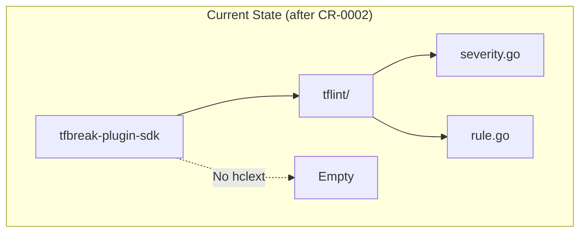
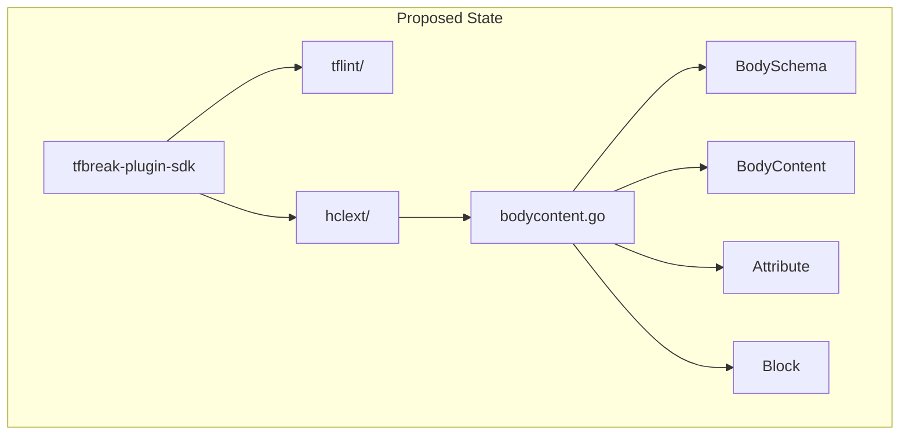

# HCL Schema Types: hclext Package

## Change Summary

Implement the `hclext` package providing HCL schema and content types: `BodySchema`, `BodyContent`, `Attribute`, `Block`, and related types. These types define the structure for querying and receiving Terraform configuration content, aligning with tflint-plugin-sdk's hclext package.

## Motivation and Background

The Runner interface (CR-0004) requires schema types to specify what configuration content to retrieve. The hclext package provides:

1. `BodySchema` - Defines expected attributes and blocks
2. `BodyContent` - Contains extracted attributes and blocks
3. Supporting types for attributes, blocks, and schema modes

Per ADR-0001, these types align with tflint-plugin-sdk's hclext package for ecosystem familiarity. The package has no dependencies on other SDK packages (only github.com/hashicorp/hcl/v2).

## Change Drivers

* Runner interface requires schema types for GetOld*/GetNew* methods
* TestRunner needs to parse and return BodyContent
* tflint alignment requires matching type names and structures
* Standalone package enables parallel development

## Current State

After CR-0002, the SDK has:
- `tflint/severity.go` - Severity type
- `tflint/rule.go` - DefaultRule struct

No hclext package exists.

### Current State Diagram



## Proposed Change

Create the `hclext/` package with:
1. `bodycontent.go` - Schema and content types
2. `bodycontent_test.go` - Tests

### Proposed State Diagram



## Requirements

### Functional Requirements

1. The SDK **MUST** define `type BodySchema struct` with fields: `Attributes`, `Blocks`, `Mode`
2. The SDK **MUST** define `type AttributeSchema struct` with fields: `Name`, `Required`
3. The SDK **MUST** define `type BlockSchema struct` with fields: `Type`, `LabelNames`, `Body`
4. The SDK **MUST** define `type SchemaMode int` with constants: `SchemaDefaultMode`, `SchemaJustAttributesMode`
5. The SDK **MUST** define `type BodyContent struct` with fields: `Attributes`, `Blocks`
6. The SDK **MUST** define `type Attribute struct` with fields: `Name`, `Expr`, `Range`, `NameRange`
7. The SDK **MUST** define `type Block struct` with fields: `Type`, `Labels`, `Body`, `DefRange`, `TypeRange`, `LabelRanges`
8. The SDK **MUST** provide `func ToHCLBodySchema(*BodySchema) *hcl.BodySchema` for schema conversion
9. The SDK **MUST** provide `func FromHCLAttribute(*hcl.Attribute) *Attribute` for attribute conversion
10. All types **MUST** have GoDoc comments explaining their purpose

### Non-Functional Requirements

1. The package **MUST** have only `github.com/hashicorp/hcl/v2` as an external dependency
2. The package **MUST** compile independently with `go build ./hclext/...`
3. All tests **MUST** pass with `go test -race ./hclext/...`

## Affected Components

* `tfbreak-plugin-sdk/hclext/bodycontent.go` - New file
* `tfbreak-plugin-sdk/hclext/bodycontent_test.go` - New file
* `tfbreak-plugin-sdk/go.mod` - Add hcl/v2 dependency (if not present)

## Scope Boundaries

### In Scope

* BodySchema and related schema types
* BodyContent and related content types
* Conversion helpers (ToHCLBodySchema, FromHCLAttribute)
* Unit tests for conversions

### Out of Scope ("Here, But Not Further")

* Expression evaluation - Not needed per ADR-0001
* Expression walking - Not needed per ADR-0001
* Dynamic block expansion - Not needed per ADR-0001
* HCL parsing functions - Deferred to helper package (CR-0006)

## Impact Assessment

### User Impact

None - internal SDK development.

### Technical Impact

* Adds hcl/v2 dependency to go.mod
* Creates standalone package with no internal SDK dependencies
* Enables Runner interface implementation (CR-0004)

### Business Impact

* Unblocks CR-0004 and CR-0006
* Maintains tflint alignment for ecosystem familiarity

## Implementation Approach

### File: hclext/bodycontent.go

```go
// Package hclext provides extended HCL types for tfbreak plugins.
// Types align with tflint-plugin-sdk/hclext for ecosystem familiarity.
package hclext

import (
    "github.com/hashicorp/hcl/v2"
)

// SchemaMode specifies how schema matching behaves.
type SchemaMode int

const (
    // SchemaDefaultMode requires explicitly declared attributes and blocks.
    SchemaDefaultMode SchemaMode = iota
    // SchemaJustAttributesMode extracts all attributes without explicit declaration.
    SchemaJustAttributesMode
)

// BodySchema represents the expected structure of an HCL body.
// Use this to specify what attributes and blocks to extract from configuration.
type BodySchema struct {
    // Attributes defines expected attributes.
    Attributes []AttributeSchema
    // Blocks defines expected nested blocks.
    Blocks []BlockSchema
    // Mode specifies schema matching behavior.
    Mode SchemaMode
}

// AttributeSchema represents an expected HCL attribute.
type AttributeSchema struct {
    // Name is the attribute name to match.
    Name string
    // Required indicates if the attribute must be present.
    Required bool
}

// BlockSchema represents an expected HCL block.
type BlockSchema struct {
    // Type is the block type to match (e.g., "resource", "variable").
    Type string
    // LabelNames are the names for block labels (e.g., ["type", "name"] for resources).
    LabelNames []string
    // Body is the schema for the block's body content.
    Body *BodySchema
}

// BodyContent represents extracted content from an HCL body.
type BodyContent struct {
    // Attributes maps attribute names to their content.
    Attributes map[string]*Attribute
    // Blocks contains extracted block content.
    Blocks []*Block
}

// Attribute represents an extracted HCL attribute.
type Attribute struct {
    // Name is the attribute name.
    Name string
    // Expr is the attribute's value expression.
    // This may be nil when received over gRPC; use Value instead.
    Expr hcl.Expression
    // Value is the pre-evaluated attribute value.
    // This is populated when the attribute is received over gRPC
    // (since hcl.Expression cannot be serialized).
    Value cty.Value
    // Range is the source range of the entire attribute.
    Range hcl.Range
    // NameRange is the source range of just the attribute name.
    NameRange hcl.Range
}

// Block represents an extracted HCL block.
type Block struct {
    // Type is the block type (e.g., "resource").
    Type string
    // Labels are the block's label values.
    Labels []string
    // Body is the block's body content.
    Body *BodyContent
    // DefRange is the source range of the block definition.
    DefRange hcl.Range
    // TypeRange is the source range of the block type.
    TypeRange hcl.Range
    // LabelRanges are the source ranges of each label.
    LabelRanges []hcl.Range
}

// ToHCLBodySchema converts a BodySchema to an hcl.BodySchema.
// This is useful when using hcl.Body.Content() or PartialContent().
func ToHCLBodySchema(schema *BodySchema) *hcl.BodySchema {
    if schema == nil {
        return nil
    }

    hclSchema := &hcl.BodySchema{
        Attributes: make([]hcl.AttributeSchema, len(schema.Attributes)),
        Blocks:     make([]hcl.BlockHeaderSchema, len(schema.Blocks)),
    }

    for i, attr := range schema.Attributes {
        hclSchema.Attributes[i] = hcl.AttributeSchema{
            Name:     attr.Name,
            Required: attr.Required,
        }
    }

    for i, block := range schema.Blocks {
        hclSchema.Blocks[i] = hcl.BlockHeaderSchema{
            Type:       block.Type,
            LabelNames: block.LabelNames,
        }
    }

    return hclSchema
}

// FromHCLAttribute converts an hcl.Attribute to an Attribute.
func FromHCLAttribute(attr *hcl.Attribute) *Attribute {
    if attr == nil {
        return nil
    }
    return &Attribute{
        Name:      attr.Name,
        Expr:      attr.Expr,
        Range:     attr.Range,
        NameRange: attr.NameRange,
    }
}

// FromHCLBlock converts an hcl.Block to a Block.
// Note: Body content must be extracted separately using the block's Body field.
func FromHCLBlock(block *hcl.Block) *Block {
    if block == nil {
        return nil
    }
    return &Block{
        Type:        block.Type,
        Labels:      block.Labels,
        Body:        nil, // Must be populated by caller
        DefRange:    block.DefRange,
        TypeRange:   block.TypeRange,
        LabelRanges: block.LabelRanges,
    }
}

// FromHCLBodyContent converts an hcl.BodyContent to a BodyContent.
// Note: Nested block bodies must be processed separately.
func FromHCLBodyContent(content *hcl.BodyContent) *BodyContent {
    if content == nil {
        return nil
    }

    bc := &BodyContent{
        Attributes: make(map[string]*Attribute, len(content.Attributes)),
        Blocks:     make([]*Block, len(content.Blocks)),
    }

    for name, attr := range content.Attributes {
        bc.Attributes[name] = FromHCLAttribute(attr)
    }

    for i, block := range content.Blocks {
        bc.Blocks[i] = FromHCLBlock(block)
    }

    return bc
}
```

## Test Strategy

### Tests to Add

| Test File | Test Name | Description | Inputs | Expected Output |
|-----------|-----------|-------------|--------|-----------------|
| `hclext/bodycontent_test.go` | `TestSchemaMode_Values` | Verify mode constants | SchemaDefaultMode, SchemaJustAttributesMode | 0, 1 |
| `hclext/bodycontent_test.go` | `TestToHCLBodySchema_Nil` | Verify nil handling | nil | nil |
| `hclext/bodycontent_test.go` | `TestToHCLBodySchema_Attributes` | Verify attribute conversion | Schema with 2 attrs | hcl.BodySchema with 2 attrs |
| `hclext/bodycontent_test.go` | `TestToHCLBodySchema_Blocks` | Verify block conversion | Schema with block | hcl.BodySchema with block |
| `hclext/bodycontent_test.go` | `TestFromHCLAttribute_Nil` | Verify nil handling | nil | nil |
| `hclext/bodycontent_test.go` | `TestFromHCLAttribute_Valid` | Verify attribute conversion | hcl.Attribute | Attribute with same values |
| `hclext/bodycontent_test.go` | `TestFromHCLBlock_Nil` | Verify nil handling | nil | nil |
| `hclext/bodycontent_test.go` | `TestFromHCLBlock_Valid` | Verify block conversion | hcl.Block | Block with same values |
| `hclext/bodycontent_test.go` | `TestFromHCLBodyContent_Nil` | Verify nil handling | nil | nil |
| `hclext/bodycontent_test.go` | `TestFromHCLBodyContent_Valid` | Verify content conversion | hcl.BodyContent | BodyContent with same values |

### Tests to Modify

Not applicable - new package.

### Tests to Remove

Not applicable - new package.

## Acceptance Criteria

### AC-1: BodySchema can be created and converted

```gherkin
Given a BodySchema with attributes and blocks
When ToHCLBodySchema() is called
Then an hcl.BodySchema is returned with matching attributes and blocks
```

### AC-2: AttributeSchema preserves fields

```gherkin
Given an AttributeSchema with Name="location" and Required=true
When converted to hcl.AttributeSchema
Then the hcl.AttributeSchema has Name="location" and Required=true
```

### AC-3: BlockSchema preserves fields

```gherkin
Given a BlockSchema with Type="resource" and LabelNames=["type", "name"]
When converted to hcl.BlockHeaderSchema
Then the hcl.BlockHeaderSchema has Type="resource" and LabelNames=["type", "name"]
```

### AC-4: FromHCLAttribute converts correctly

```gherkin
Given an hcl.Attribute with Name, Expr, Range, NameRange
When FromHCLAttribute() is called
Then the returned Attribute has all fields populated correctly
```

### AC-5: FromHCLBodyContent converts attributes and blocks

```gherkin
Given an hcl.BodyContent with attributes and blocks
When FromHCLBodyContent() is called
Then the returned BodyContent has converted attributes and blocks
```

### AC-6: Nil inputs return nil outputs

```gherkin
Given nil input to any conversion function
When the function is called
Then nil is returned without error
```

## Quality Standards Compliance

### Build & Compilation

- [ ] Code compiles/builds without errors
- [ ] No new compiler warnings introduced

### Linting & Code Style

- [ ] All linter checks pass with zero warnings/errors
- [ ] Code follows project coding conventions and style guides
- [ ] Any linter exceptions are documented with justification

### Test Execution

- [ ] All existing tests pass after implementation
- [ ] All new tests pass
- [ ] Test coverage meets project requirements for changed code

### Documentation

- [ ] Inline code documentation updated where applicable
- [ ] API documentation updated for any API changes
- [ ] User-facing documentation updated if behavior changes

### Code Review

- [ ] Changes submitted via pull request
- [ ] PR title follows Conventional Commits format
- [ ] Code review completed and approved
- [ ] Changes squash-merged to maintain linear history

### Verification Commands

```bash
# Build verification
go build ./hclext/...

# Lint verification
go vet ./hclext/...

# Test execution
go test -race -v ./hclext/...

# Test coverage
go test -coverprofile=coverage.out ./hclext/...
go tool cover -func=coverage.out
```

## Risks and Mitigation

### Risk 1: Type mismatch with tflint-plugin-sdk

**Likelihood:** Low
**Impact:** Medium
**Mitigation:** Reference tflint-plugin-sdk/hclext source directly; types don't need to be identical, just similar

### Risk 2: Missing conversion edge cases

**Likelihood:** Medium
**Impact:** Low
**Mitigation:** Add comprehensive nil handling; expand tests based on helper package usage (CR-0006)

## Dependencies

* ADR-0001 - Architecture decisions
* CR-0001 - Overall scope
* github.com/hashicorp/hcl/v2 - HCL types
* No internal SDK dependencies

## Estimated Effort

| Task | Effort |
|------|--------|
| bodycontent.go types | 30 minutes |
| Conversion functions | 20 minutes |
| bodycontent_test.go | 40 minutes |
| Documentation | 15 minutes |
| **Total** | **~1.75 hours** |

## Decision Outcome

Chosen approach: "Create standalone hclext package with minimal types", because it enables Runner interface (CR-0004) while maintaining tflint alignment.

## Related Items

* Architecture decisions: ADR-0001-tflint-aligned-plugin-sdk.md
* Parent CR: CR-0001-minimum-viable-sdk.md
* Previous CR: CR-0002-core-types.md
* Next CR: CR-0004-rule-runner-interfaces.md (uses hclext types)
* Dependent CR: CR-0006-helper-package.md (uses hclext types)
