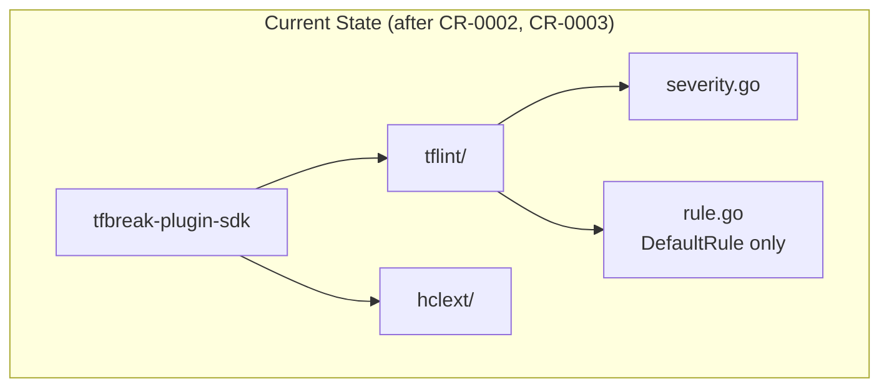
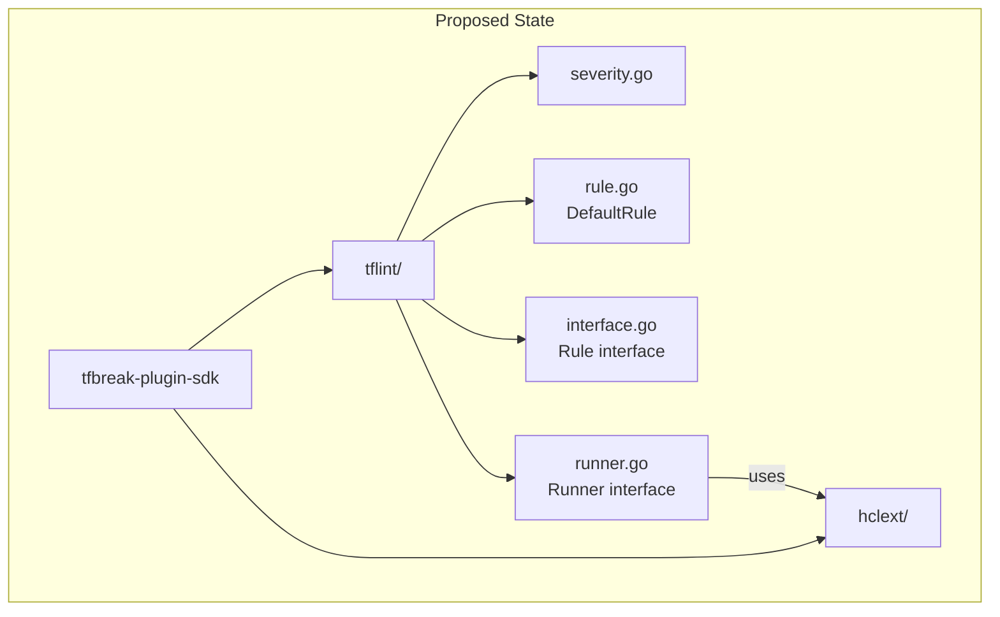

# Rule and Runner Interfaces

## Change Summary

Implement the `Rule` and `Runner` interfaces in the tflint package. The Rule interface defines the contract for individual rules, while the Runner interface provides dual-config access methods (GetOld*/GetNew*) - the key deviation from tflint-plugin-sdk documented in ADR-0001.

## Motivation and Background

The Rule and Runner interfaces are the core contracts between tfbreak-core and plugins:

- **Rule**: Defines what a rule does (Name, Check, Severity, etc.)
- **Runner**: Provides access to configurations during rule execution

Per ADR-0001, the Runner interface has a critical deviation from tflint: dual-config access methods instead of single-config. This is because tfbreak compares two configurations (old vs new) to detect breaking changes.

## Change Drivers

* Rule interface needed for plugin implementations
* Runner interface needed for configuration access
* Dual-config model is tfbreak's core differentiator
* Enables RuleSet implementation (CR-0005)

## Current State

After CR-0002 and CR-0003, the SDK has:
- `tflint/severity.go` - Severity type
- `tflint/rule.go` - DefaultRule struct
- `hclext/bodycontent.go` - Schema types

Rule and Runner interfaces don't exist yet.

### Current State Diagram



## Proposed Change

Add to the `tflint/` package:
1. `interface.go` - Rule interface
2. `runner.go` - Runner interface and option types

### Proposed State Diagram



## Requirements

### Functional Requirements

1. The SDK **MUST** define `type Rule interface` with methods: `Name()`, `Enabled()`, `Severity()`, `Link()`, `Check(Runner) error`
2. The SDK **MUST** define `type Runner interface` with dual-config methods as specified in ADR-0001
3. The Runner **MUST** provide `GetOldModuleContent(schema, opts)` and `GetNewModuleContent(schema, opts)`
4. The Runner **MUST** provide `GetOldResourceContent(resourceType, schema, opts)` and `GetNewResourceContent(resourceType, schema, opts)`
5. The Runner **MUST** provide `EmitIssue(rule, message, issueRange) error`
6. The Runner **MUST** provide `DecodeRuleConfig(ruleName, target) error`
7. The SDK **MUST** define `type GetModuleContentOption struct` with fields: `ModuleCtx`, `ExpandMode`, `Hint`
8. The SDK **MUST** define `type ModuleCtxType int` with constants: `ModuleCtxSelf`, `ModuleCtxRoot`, `ModuleCtxAll`
9. All interfaces **MUST** have GoDoc comments referencing ADR-0001 for deviations

### Non-Functional Requirements

1. The package **MUST** compile with `go build ./tflint/...`
2. Interface documentation **MUST** clearly indicate dual-config deviation from tflint

## Affected Components

* `tfbreak-plugin-sdk/tflint/interface.go` - New file (Rule interface)
* `tfbreak-plugin-sdk/tflint/runner.go` - New file (Runner interface)
* `tfbreak-plugin-sdk/tflint/rule.go` - Update DefaultRule GoDoc to reference Rule interface

## Scope Boundaries

### In Scope

* Rule interface definition
* Runner interface with dual-config methods
* GetModuleContentOption and related option types
* ModuleCtxType and ExpandMode constants
* GoDoc documentation

### Out of Scope ("Here, But Not Further")

* RuleSet interface - Deferred to CR-0005
* BuiltinRuleSet implementation - Deferred to CR-0005
* Config types - Deferred to CR-0005
* Runner implementation (mock) - Deferred to CR-0006
* Extended methods (EvaluateExpr, etc.) - Not needed per ADR-0001

## Impact Assessment

### User Impact

Plugin authors can now define rules that satisfy the Rule interface.

### Technical Impact

* Introduces core contracts for plugin development
* Documents tfbreak's dual-config deviation clearly
* Creates import dependency: tflint → hclext

### Business Impact

* Core interfaces enable plugin development
* Clear documentation reduces confusion about dual-config model

## Implementation Approach

### File: tflint/interface.go

```go
package tflint

// Rule is the interface that all tfbreak rules must implement.
// This aligns with tflint-plugin-sdk's Rule interface for ecosystem familiarity.
//
// Plugin authors typically embed DefaultRule to get default implementations
// for Enabled() and Severity(), then implement the remaining methods.
//
// Example:
//
//	type MyRule struct {
//	    tflint.DefaultRule
//	}
//
//	func (r *MyRule) Name() string { return "my_rule" }
//	func (r *MyRule) Link() string { return "https://example.com/my_rule" }
//	func (r *MyRule) Check(runner tflint.Runner) error {
//	    // Access old and new configs via runner
//	    oldContent, _ := runner.GetOldResourceContent("azurerm_resource_group", schema, nil)
//	    newContent, _ := runner.GetNewResourceContent("azurerm_resource_group", schema, nil)
//	    // Compare and emit issues
//	    return nil
//	}
type Rule interface {
    // Name returns the unique name of the rule.
    // Convention: lowercase with underscores (e.g., "azurerm_force_new").
    Name() string

    // Enabled returns whether the rule is enabled by default.
    // Most rules return true; embed DefaultRule for this behavior.
    Enabled() bool

    // Severity returns the default severity level for issues.
    // Most rules return ERROR; embed DefaultRule for this behavior.
    Severity() Severity

    // Link returns a URL to documentation about the rule.
    // Should explain what the rule checks and how to resolve issues.
    Link() string

    // Check executes the rule against the configurations accessible via runner.
    // Call runner.EmitIssue() for each finding.
    // Return an error only for unexpected failures, not for findings.
    Check(runner Runner) error
}
```

### File: tflint/runner.go

```go
package tflint

import (
    "github.com/hashicorp/hcl/v2"
    "github.com/jokarl/tfbreak-plugin-sdk/hclext"
)

// Runner provides access to Terraform configurations during rule execution.
//
// DEVIATION FROM TFLINT (see ADR-0001):
// Unlike tflint's Runner which accesses a single configuration, tfbreak's
// Runner provides dual-config access via GetOld* and GetNew* methods.
// This is because tfbreak compares two configurations to detect breaking changes.
//
// tflint:  runner.GetResourceContent(...)     // Single config
// tfbreak: runner.GetOldResourceContent(...)  // Old (baseline) config
//          runner.GetNewResourceContent(...)  // New (changed) config
type Runner interface {
    // GetOldModuleContent retrieves module content from the OLD (baseline) configuration.
    // Use this to access the state before the change.
    GetOldModuleContent(schema *hclext.BodySchema, opts *GetModuleContentOption) (*hclext.BodyContent, error)

    // GetNewModuleContent retrieves module content from the NEW configuration.
    // Use this to access the state after the change.
    GetNewModuleContent(schema *hclext.BodySchema, opts *GetModuleContentOption) (*hclext.BodyContent, error)

    // GetOldResourceContent retrieves resources of a specific type from the OLD configuration.
    // This is a convenience method that wraps GetOldModuleContent with a resource schema.
    GetOldResourceContent(resourceType string, schema *hclext.BodySchema, opts *GetModuleContentOption) (*hclext.BodyContent, error)

    // GetNewResourceContent retrieves resources of a specific type from the NEW configuration.
    // This is a convenience method that wraps GetNewModuleContent with a resource schema.
    GetNewResourceContent(resourceType string, schema *hclext.BodySchema, opts *GetModuleContentOption) (*hclext.BodyContent, error)

    // EmitIssue reports a finding from the rule.
    // The issueRange should point to the relevant location in the NEW configuration.
    // For breaking changes, this is typically where the problematic change was made.
    EmitIssue(rule Rule, message string, issueRange hcl.Range) error

    // DecodeRuleConfig retrieves and decodes the rule's configuration.
    // The target should be a pointer to a struct with hcl tags.
    // Returns nil if no configuration is provided for the rule.
    DecodeRuleConfig(ruleName string, target any) error
}

// GetModuleContentOption configures how content is retrieved.
// Aligns with tflint-plugin-sdk's option struct.
type GetModuleContentOption struct {
    // ModuleCtx specifies which module context to use.
    ModuleCtx ModuleCtxType
    // ExpandMode specifies how to handle dynamic blocks.
    ExpandMode ExpandMode
    // Hint provides hints for optimization.
    Hint GetModuleContentHint
}

// ModuleCtxType specifies the module context for content retrieval.
type ModuleCtxType int

const (
    // ModuleCtxSelf retrieves content from the current module only.
    ModuleCtxSelf ModuleCtxType = iota
    // ModuleCtxRoot retrieves content from the root module.
    ModuleCtxRoot
    // ModuleCtxAll retrieves content from all modules.
    ModuleCtxAll
)

// ExpandMode specifies how dynamic blocks are handled.
type ExpandMode int

const (
    // ExpandModeNone does not expand dynamic blocks.
    ExpandModeNone ExpandMode = iota
    // ExpandModeExpand expands dynamic blocks (not currently implemented).
    ExpandModeExpand
)

// GetModuleContentHint provides optimization hints for content retrieval.
type GetModuleContentHint struct {
    // ResourceType hints at the expected resource type for optimization.
    ResourceType string
}
```

## Test Strategy

### Tests to Add

| Test File | Test Name | Description | Inputs | Expected Output |
|-----------|-----------|-------------|--------|-----------------|
| `tflint/interface_test.go` | `TestRule_Interface` | Verify interface is implementable | Mock rule | Compiles |
| `tflint/runner_test.go` | `TestModuleCtxType_Values` | Verify context constants | ModuleCtxSelf, etc. | 0, 1, 2 |
| `tflint/runner_test.go` | `TestExpandMode_Values` | Verify expand constants | ExpandModeNone, etc. | 0, 1 |

Note: Interface tests are primarily compilation tests. Actual behavior testing occurs in CR-0006 (helper package).

### Tests to Modify

Not applicable.

### Tests to Remove

Not applicable.

## Acceptance Criteria

### AC-1: Rule interface is complete

```gherkin
Given the tflint package
When a struct implements Name(), Enabled(), Severity(), Link(), Check(Runner)
Then it satisfies the Rule interface
```

### AC-2: Runner interface has dual-config methods

```gherkin
Given the Runner interface
When inspecting its methods
Then it has GetOldModuleContent and GetNewModuleContent
  And it has GetOldResourceContent and GetNewResourceContent
  And it has EmitIssue and DecodeRuleConfig
```

### AC-3: DefaultRule satisfies partial Rule interface

```gherkin
Given a struct that embeds DefaultRule
  And implements Name(), Link(), Check()
When used as a Rule
Then it compiles and satisfies the interface
```

### AC-4: GetModuleContentOption has required fields

```gherkin
Given GetModuleContentOption struct
When inspected
Then it has ModuleCtx, ExpandMode, and Hint fields
```

### AC-5: Documentation references ADR-0001

```gherkin
Given the Runner interface GoDoc
When read by a developer
Then it clearly indicates the dual-config deviation from tflint
  And references ADR-0001 for details
```

## Quality Standards Compliance

### Build & Compilation

- [ ] Code compiles/builds without errors
- [ ] No new compiler warnings introduced

### Linting & Code Style

- [ ] All linter checks pass with zero warnings/errors
- [ ] Code follows project coding conventions and style guides
- [ ] Any linter exceptions are documented with justification

### Test Execution

- [ ] All existing tests pass after implementation
- [ ] All new tests pass
- [ ] Test coverage meets project requirements for changed code

### Documentation

- [ ] Inline code documentation updated where applicable
- [ ] API documentation updated for any API changes
- [ ] User-facing documentation updated if behavior changes

### Code Review

- [ ] Changes submitted via pull request
- [ ] PR title follows Conventional Commits format
- [ ] Code review completed and approved
- [ ] Changes squash-merged to maintain linear history

### Verification Commands

```bash
# Build verification
go build ./tflint/...

# Lint verification
go vet ./tflint/...

# Test execution
go test -race -v ./tflint/...
```

## Risks and Mitigation

### Risk 1: Runner interface too complex

**Likelihood:** Low
**Impact:** Medium
**Mitigation:** Start minimal; add methods only as needed by actual rules

### Risk 2: Dual-config model confuses plugin authors

**Likelihood:** Medium
**Impact:** Medium
**Mitigation:** Extensive GoDoc; ADR-0001 reference; example code in documentation

## Dependencies

* ADR-0001 - Documents dual-config deviation
* CR-0002 - Severity type
* CR-0003 - hclext types (BodySchema, BodyContent)

## Estimated Effort

| Task | Effort |
|------|--------|
| interface.go (Rule) | 20 minutes |
| runner.go (Runner, options) | 30 minutes |
| Tests | 20 minutes |
| Documentation | 20 minutes |
| **Total** | **~1.5 hours** |

## Decision Outcome

Chosen approach: "Dual-config Runner with GetOld*/GetNew* methods", because it explicitly supports tfbreak's comparison model while maintaining method signature familiarity with tflint.

## Related Items

* Architecture decisions: ADR-0001-tflint-aligned-plugin-sdk.md
* Parent CR: CR-0001-minimum-viable-sdk.md
* Previous CRs: CR-0002-core-types.md, CR-0003-hclext-types.md
* Next CR: CR-0005-ruleset-builtin.md
* Dependent CR: CR-0006-helper-package.md (implements Runner mock)
