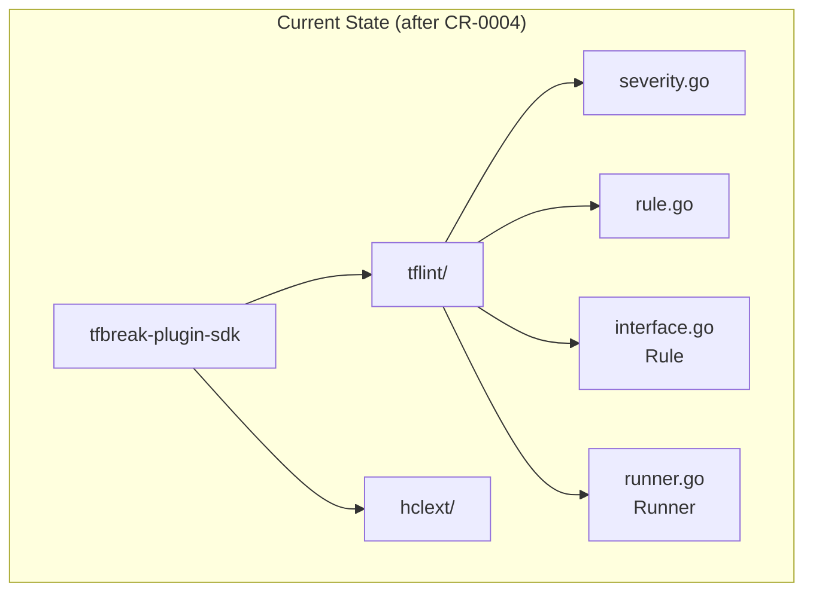
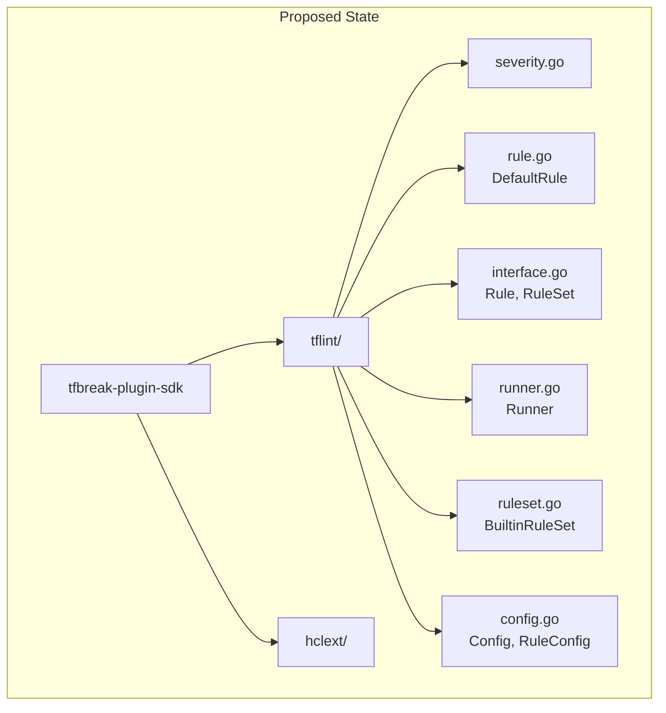

# RuleSet Interface and BuiltinRuleSet

## Change Summary

Implement the `RuleSet` interface and `BuiltinRuleSet` struct for plugin structure. RuleSet defines the plugin's metadata and rule collection, while BuiltinRuleSet provides default implementations that plugins can embed. This also includes Config types for global configuration.

## Motivation and Background

A tfbreak plugin is structured around a RuleSet that:
1. Provides metadata (name, version, constraint)
2. Contains a collection of Rules
3. Can receive global and plugin-specific configuration
4. Optionally customizes the Runner

BuiltinRuleSet provides sensible defaults so plugin authors can focus on their rules rather than boilerplate. This pattern aligns with tflint-plugin-sdk's BuiltinRuleSet.

## Change Drivers

* Plugins need a standard structure for rule collections
* BuiltinRuleSet reduces boilerplate for plugin authors
* Config types enable rule enable/disable functionality
* Completes the core interface definitions

## Current State

After CR-0004, the SDK has:
- `tflint/severity.go` - Severity type
- `tflint/rule.go` - DefaultRule struct
- `tflint/interface.go` - Rule interface
- `tflint/runner.go` - Runner interface
- `hclext/bodycontent.go` - Schema types

RuleSet interface and BuiltinRuleSet don't exist yet.

### Current State Diagram



## Proposed Change

Add to the `tflint/` package:
1. Update `interface.go` - Add RuleSet interface
2. `ruleset.go` - BuiltinRuleSet implementation
3. `config.go` - Config and RuleConfig types

### Proposed State Diagram



## Requirements

### Functional Requirements

1. The SDK **MUST** define `type RuleSet interface` with methods:
   - `RuleSetName() string`
   - `RuleSetVersion() string`
   - `RuleNames() []string`
   - `VersionConstraint() string`
   - `ConfigSchema() *hclext.BodySchema`
   - `ApplyGlobalConfig(*Config) error`
   - `ApplyConfig(*hclext.BodyContent) error`
   - `NewRunner(Runner) (Runner, error)`
   - `BuiltinImpl() *BuiltinRuleSet`

2. The SDK **MUST** define `type BuiltinRuleSet struct` with fields: `Name`, `Version`, `Constraint`, `Rules`

3. BuiltinRuleSet **MUST** implement all RuleSet methods with sensible defaults

4. The SDK **MUST** define `type Config struct` with fields: `Rules`, `DisabledByDefault`, `Only`, `PluginDir`

5. The SDK **MUST** define `type RuleConfig struct` with fields: `Name`, `Enabled`, `Body`

6. BuiltinRuleSet.ApplyGlobalConfig **MUST** handle `DisabledByDefault` and `Only` filtering

7. BuiltinRuleSet **MUST** provide `IsRuleEnabled(name) bool` helper method

8. BuiltinRuleSet **MUST** provide `GetRule(name) Rule` helper method

### Non-Functional Requirements

1. The package **MUST** compile with `go build ./tflint/...`
2. All tests **MUST** pass with `go test -race ./tflint/...`
3. GoDoc **MUST** include usage examples for BuiltinRuleSet

## Affected Components

* `tfbreak-plugin-sdk/tflint/interface.go` - Add RuleSet interface
* `tfbreak-plugin-sdk/tflint/ruleset.go` - New file (BuiltinRuleSet)
* `tfbreak-plugin-sdk/tflint/ruleset_test.go` - New file
* `tfbreak-plugin-sdk/tflint/config.go` - New file
* `tfbreak-plugin-sdk/tflint/config_test.go` - New file

## Scope Boundaries

### In Scope

* RuleSet interface definition
* BuiltinRuleSet implementation with all default methods
* Config and RuleConfig types
* Helper methods (IsRuleEnabled, GetRule)
* Unit tests

### Out of Scope ("Here, But Not Further")

* Plugin Serve() function - Deferred to CR-0007
* gRPC communication - Future CR
* Rule configuration parsing - Rules handle their own config

## Impact Assessment

### User Impact

Plugin authors can now structure their plugins using BuiltinRuleSet.

### Technical Impact

* Completes core interface definitions
* Enables full plugin structure
* Requires importing hclext for BodySchema in RuleSet interface

### Business Impact

* Enables tfbreak-ruleset-azurerm to use proper plugin structure
* Reduces boilerplate for plugin authors

## Implementation Approach

### Add to tflint/interface.go

```go
// RuleSet is implemented by plugins to provide a collection of rules.
// Plugins typically embed BuiltinRuleSet and override methods as needed.
//
// Example:
//
//	type MyRuleSet struct {
//	    tflint.BuiltinRuleSet
//	}
//
//	func main() {
//	    plugin.Serve(&plugin.ServeOpts{
//	        RuleSet: &MyRuleSet{
//	            BuiltinRuleSet: tflint.BuiltinRuleSet{
//	                Name:    "myplugin",
//	                Version: "0.1.0",
//	                Rules:   []tflint.Rule{&MyRule{}},
//	            },
//	        },
//	    })
//	}
type RuleSet interface {
    // RuleSetName returns the name of the ruleset (e.g., "azurerm").
    RuleSetName() string

    // RuleSetVersion returns the version of the ruleset (e.g., "0.1.0").
    RuleSetVersion() string

    // RuleNames returns the names of all rules in this ruleset.
    RuleNames() []string

    // VersionConstraint returns the tfbreak version constraint (e.g., ">= 0.1.0").
    VersionConstraint() string

    // ConfigSchema returns the schema for plugin-specific configuration.
    // Return nil if no configuration is needed.
    ConfigSchema() *hclext.BodySchema

    // ApplyGlobalConfig applies global tfbreak configuration.
    // Called before ApplyConfig.
    ApplyGlobalConfig(*Config) error

    // ApplyConfig applies plugin-specific configuration.
    // The content matches the schema from ConfigSchema().
    ApplyConfig(*hclext.BodyContent) error

    // NewRunner optionally wraps the runner with custom behavior.
    // Return the runner unchanged if no customization is needed.
    NewRunner(Runner) (Runner, error)

    // BuiltinImpl returns the embedded BuiltinRuleSet.
    // Used internally for rule iteration.
    BuiltinImpl() *BuiltinRuleSet
}
```

### File: tflint/ruleset.go

```go
package tflint

import "github.com/jokarl/tfbreak-plugin-sdk/hclext"

// BuiltinRuleSet provides default implementations for the RuleSet interface.
// Plugin authors embed this struct and override methods as needed.
//
// Example:
//
//	type AzurermRuleSet struct {
//	    tflint.BuiltinRuleSet
//	}
//
//	rs := &AzurermRuleSet{
//	    BuiltinRuleSet: tflint.BuiltinRuleSet{
//	        Name:       "azurerm",
//	        Version:    "0.1.0",
//	        Constraint: ">= 0.1.0",
//	        Rules:      []tflint.Rule{&ForceNewRule{}},
//	    },
//	}
type BuiltinRuleSet struct {
    // Name is the ruleset name (e.g., "azurerm").
    Name string
    // Version is the ruleset version (e.g., "0.1.0").
    Version string
    // Constraint is the tfbreak version constraint (e.g., ">= 0.1.0").
    Constraint string
    // Rules is the list of rules in this ruleset.
    Rules []Rule
    // enabledRules tracks which rules are enabled after configuration.
    enabledRules map[string]bool
}

// RuleSetName returns the name of the ruleset.
func (rs *BuiltinRuleSet) RuleSetName() string {
    return rs.Name
}

// RuleSetVersion returns the version of the ruleset.
func (rs *BuiltinRuleSet) RuleSetVersion() string {
    return rs.Version
}

// RuleNames returns the names of all rules in this ruleset.
func (rs *BuiltinRuleSet) RuleNames() []string {
    names := make([]string, len(rs.Rules))
    for i, rule := range rs.Rules {
        names[i] = rule.Name()
    }
    return names
}

// VersionConstraint returns the tfbreak version constraint.
func (rs *BuiltinRuleSet) VersionConstraint() string {
    if rs.Constraint == "" {
        return ">= 0.1.0"
    }
    return rs.Constraint
}

// ConfigSchema returns nil (no plugin-specific configuration by default).
func (rs *BuiltinRuleSet) ConfigSchema() *hclext.BodySchema {
    return nil
}

// ApplyGlobalConfig applies global tfbreak configuration.
// Handles DisabledByDefault and Only filtering.
func (rs *BuiltinRuleSet) ApplyGlobalConfig(config *Config) error {
    rs.enabledRules = make(map[string]bool)

    // Initialize with rule defaults
    for _, rule := range rs.Rules {
        rs.enabledRules[rule.Name()] = rule.Enabled()
    }

    if config == nil {
        return nil
    }

    // Handle DisabledByDefault
    if config.DisabledByDefault {
        for name := range rs.enabledRules {
            rs.enabledRules[name] = false
        }
    }

    // Handle Only filter
    if len(config.Only) > 0 {
        for name := range rs.enabledRules {
            rs.enabledRules[name] = false
        }
        for _, name := range config.Only {
            if _, ok := rs.enabledRules[name]; ok {
                rs.enabledRules[name] = true
            }
        }
    }

    // Apply per-rule configuration
    for name, ruleConfig := range config.Rules {
        if _, ok := rs.enabledRules[name]; ok {
            rs.enabledRules[name] = ruleConfig.Enabled
        }
    }

    return nil
}

// ApplyConfig applies plugin-specific configuration.
// Default implementation does nothing.
func (rs *BuiltinRuleSet) ApplyConfig(content *hclext.BodyContent) error {
    return nil
}

// NewRunner returns the runner unchanged by default.
func (rs *BuiltinRuleSet) NewRunner(runner Runner) (Runner, error) {
    return runner, nil
}

// BuiltinImpl returns the BuiltinRuleSet itself.
func (rs *BuiltinRuleSet) BuiltinImpl() *BuiltinRuleSet {
    return rs
}

// IsRuleEnabled returns whether a rule is enabled.
// Call this after ApplyGlobalConfig.
func (rs *BuiltinRuleSet) IsRuleEnabled(name string) bool {
    if rs.enabledRules == nil {
        // Not yet configured; use rule default
        for _, rule := range rs.Rules {
            if rule.Name() == name {
                return rule.Enabled()
            }
        }
        return false
    }
    return rs.enabledRules[name]
}

// GetRule returns a rule by name, or nil if not found.
func (rs *BuiltinRuleSet) GetRule(name string) Rule {
    for _, rule := range rs.Rules {
        if rule.Name() == name {
            return rule
        }
    }
    return nil
}

// EnabledRules returns all currently enabled rules.
func (rs *BuiltinRuleSet) EnabledRules() []Rule {
    var enabled []Rule
    for _, rule := range rs.Rules {
        if rs.IsRuleEnabled(rule.Name()) {
            enabled = append(enabled, rule)
        }
    }
    return enabled
}
```

### File: tflint/config.go

```go
package tflint

import "github.com/hashicorp/hcl/v2"

// Config represents global tfbreak configuration passed to plugins.
type Config struct {
    // Rules maps rule names to their configuration.
    Rules map[string]*RuleConfig
    // DisabledByDefault indicates if rules are disabled by default.
    DisabledByDefault bool
    // Only enables only these rules if set.
    Only []string
    // PluginDir is the directory where plugins are installed.
    PluginDir string
}

// RuleConfig represents configuration for a single rule.
type RuleConfig struct {
    // Name is the rule name.
    Name string
    // Enabled indicates if the rule is enabled.
    Enabled bool
    // Body is the raw HCL body for rule-specific configuration.
    Body hcl.Body
}
```

## Test Strategy

### Tests to Add

| Test File | Test Name | Description | Inputs | Expected Output |
|-----------|-----------|-------------|--------|-----------------|
| `tflint/ruleset_test.go` | `TestBuiltinRuleSet_RuleSetName` | Verify name return | RuleSet with Name="test" | "test" |
| `tflint/ruleset_test.go` | `TestBuiltinRuleSet_RuleSetVersion` | Verify version return | RuleSet with Version="1.0" | "1.0" |
| `tflint/ruleset_test.go` | `TestBuiltinRuleSet_RuleNames` | Verify rule names | RuleSet with 2 rules | []string with 2 names |
| `tflint/ruleset_test.go` | `TestBuiltinRuleSet_VersionConstraint_Default` | Verify default constraint | Empty Constraint | ">= 0.1.0" |
| `tflint/ruleset_test.go` | `TestBuiltinRuleSet_VersionConstraint_Custom` | Verify custom constraint | Constraint=">= 1.0" | ">= 1.0" |
| `tflint/ruleset_test.go` | `TestBuiltinRuleSet_ConfigSchema_Default` | Verify nil schema | Default | nil |
| `tflint/ruleset_test.go` | `TestBuiltinRuleSet_ApplyGlobalConfig_Nil` | Verify nil config handling | nil | No error, rules use defaults |
| `tflint/ruleset_test.go` | `TestBuiltinRuleSet_ApplyGlobalConfig_DisabledByDefault` | Verify disable all | DisabledByDefault=true | All rules disabled |
| `tflint/ruleset_test.go` | `TestBuiltinRuleSet_ApplyGlobalConfig_Only` | Verify only filter | Only=["rule1"] | Only rule1 enabled |
| `tflint/ruleset_test.go` | `TestBuiltinRuleSet_ApplyGlobalConfig_RuleConfig` | Verify per-rule config | Rules with enabled=false | Specific rule disabled |
| `tflint/ruleset_test.go` | `TestBuiltinRuleSet_IsRuleEnabled` | Verify enabled check | Rule after config | Correct enabled state |
| `tflint/ruleset_test.go` | `TestBuiltinRuleSet_GetRule` | Verify rule lookup | Existing rule name | Rule returned |
| `tflint/ruleset_test.go` | `TestBuiltinRuleSet_GetRule_NotFound` | Verify not found | Unknown name | nil |
| `tflint/ruleset_test.go` | `TestBuiltinRuleSet_EnabledRules` | Verify enabled list | Mixed enabled states | Only enabled rules |
| `tflint/ruleset_test.go` | `TestBuiltinRuleSet_NewRunner` | Verify runner passthrough | Runner | Same runner |

### Tests to Modify

Not applicable.

### Tests to Remove

Not applicable.

## Acceptance Criteria

### AC-1: RuleSet interface is complete

```gherkin
Given the tflint package
When a struct implements all RuleSet methods
Then it satisfies the RuleSet interface
```

### AC-2: BuiltinRuleSet provides defaults

```gherkin
Given a BuiltinRuleSet with Name, Version, Rules
When used as a RuleSet
Then RuleSetName, RuleSetVersion, RuleNames return correct values
  And ConfigSchema returns nil
  And NewRunner returns the input runner
```

### AC-3: ApplyGlobalConfig handles DisabledByDefault

```gherkin
Given a BuiltinRuleSet with 3 rules (all enabled by default)
When ApplyGlobalConfig is called with DisabledByDefault=true
Then IsRuleEnabled returns false for all rules
```

### AC-4: ApplyGlobalConfig handles Only filter

```gherkin
Given a BuiltinRuleSet with rules ["a", "b", "c"]
When ApplyGlobalConfig is called with Only=["a", "c"]
Then IsRuleEnabled("a") returns true
  And IsRuleEnabled("b") returns false
  And IsRuleEnabled("c") returns true
```

### AC-5: GetRule returns correct rule

```gherkin
Given a BuiltinRuleSet with a rule named "my_rule"
When GetRule("my_rule") is called
Then the rule is returned
When GetRule("unknown") is called
Then nil is returned
```

## Quality Standards Compliance

### Verification Commands

```bash
# Build verification
go build ./tflint/...

# Lint verification
go vet ./tflint/...

# Test execution
go test -race -v ./tflint/...

# Test coverage
go test -coverprofile=coverage.out ./tflint/...
go tool cover -func=coverage.out
```

## Risks and Mitigation

### Risk 1: Config types insufficient for real-world use

**Likelihood:** Medium
**Impact:** Low
**Mitigation:** Start minimal; extend based on tfbreak-core needs

## Dependencies

* CR-0002 - Severity, DefaultRule
* CR-0003 - hclext types
* CR-0004 - Rule, Runner interfaces

## Estimated Effort

| Task | Effort |
|------|--------|
| RuleSet interface | 15 minutes |
| BuiltinRuleSet implementation | 45 minutes |
| Config types | 15 minutes |
| Tests | 60 minutes |
| Documentation | 15 minutes |
| **Total** | **~2.5 hours** |

## Decision Outcome

Chosen approach: "BuiltinRuleSet with configuration handling", because it reduces boilerplate while providing standard plugin functionality.

## Related Items

* Architecture decisions: ADR-0001-tflint-aligned-plugin-sdk.md
* Parent CR: CR-0001-minimum-viable-sdk.md
* Previous CRs: CR-0002, CR-0003, CR-0004
* Next CR: CR-0006-helper-package.md
* Dependent CR: CR-0007-plugin-serve.md (uses RuleSet)
