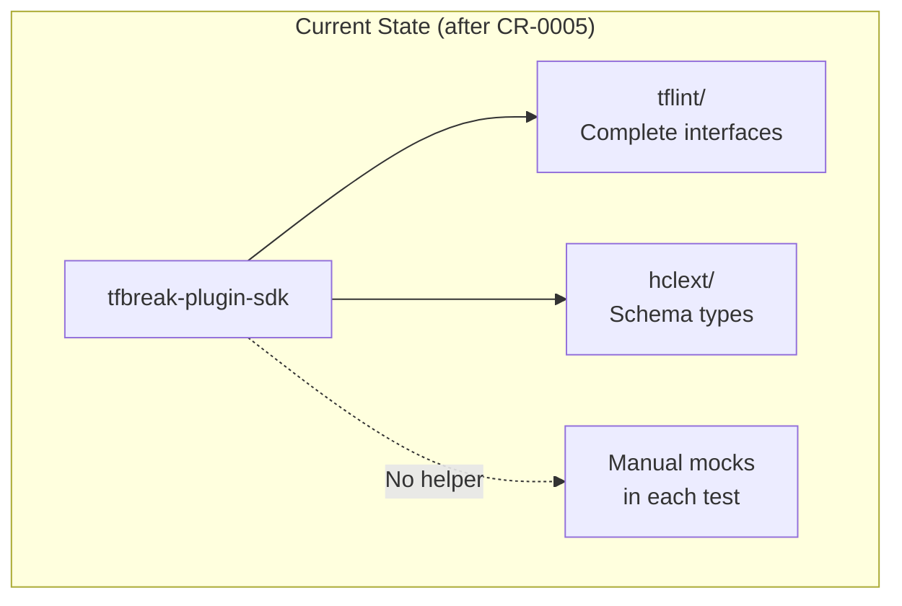
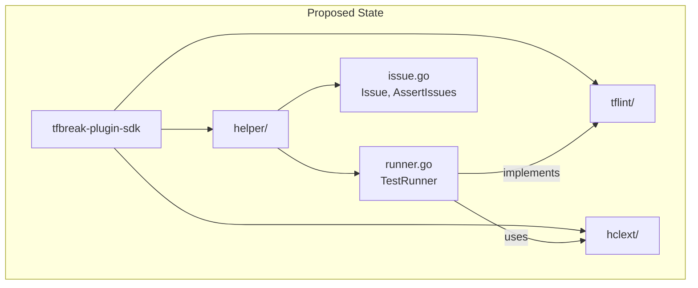

# Testing Helper Package: TestRunner and Assertions

## Change Summary

Implement the `helper` package providing testing utilities: `TestRunner` for creating mock runners from HCL content, `Issue` struct for representing findings, and `AssertIssues`/`AssertIssuesWithoutRange` for comparing expected vs actual issues. This is the critical package that enables plugin testing without tfbreak-core.

## Motivation and Background

Plugin authors need to test their rules in isolation. The helper package provides:

1. **TestRunner** - Creates a mock Runner from old/new HCL file maps
2. **Issue** - Represents a finding for test comparison
3. **AssertIssues** - Compares expected and actual issues

Per ADR-0001, the TestRunner signature differs from tflint-plugin-sdk:
- tflint: `TestRunner(t, files)` - Single config
- tfbreak: `TestRunner(t, oldFiles, newFiles)` - Dual config

This is the **most critical** package for the SDK's usability.

## Change Drivers

* Enables rule testing without tfbreak-core
* Critical for tfbreak-ruleset-azurerm development
* Replaces manual mockRunner in test files
* Aligns with tflint's helper package pattern

## Current State

After CR-0005, the SDK has complete interface definitions:
- `tflint/` - Severity, DefaultRule, Rule, Runner, RuleSet, BuiltinRuleSet, Config
- `hclext/` - BodySchema, BodyContent, Attribute, Block

Testing requires manual mock implementations.

### Current State Diagram



## Proposed Change

Create the `helper/` package with:
1. `runner.go` - TestRunner implementation
2. `issue.go` - Issue struct and assertions
3. Tests for all utilities

### Proposed State Diagram



## Requirements

### Functional Requirements

1. The SDK **MUST** provide `func TestRunner(t *testing.T, oldFiles, newFiles map[string]string) *Runner`
2. TestRunner **MUST** parse HCL content from provided file maps
3. TestRunner **MUST** implement `tflint.Runner` interface
4. TestRunner **MUST** return parsed content from `GetOld*` and `GetNew*` methods
5. TestRunner **MUST** collect issues via `EmitIssue` in an `Issues` field
6. The SDK **MUST** provide `type Issue struct` with fields: `Rule`, `Message`, `Range`
7. The SDK **MUST** provide `func AssertIssues(t *testing.T, want, got Issues)`
8. AssertIssues **MUST** ignore issue order and byte positions
9. The SDK **MUST** provide `func AssertIssuesWithoutRange(t *testing.T, want, got Issues)`
10. AssertIssuesWithoutRange **MUST** ignore Range field entirely
11. TestRunner **MUST** support `.tf` file extensions for HCL parsing

### Non-Functional Requirements

1. The package **MUST** depend only on tflint, hclext, hcl/v2, and testing packages
2. The package **MUST** use `github.com/google/go-cmp` for assertions
3. All tests **MUST** pass with `go test -race ./helper/...`
4. Test coverage **MUST** be >80% for helper package

## Affected Components

* `tfbreak-plugin-sdk/helper/runner.go` - New file
* `tfbreak-plugin-sdk/helper/runner_test.go` - New file
* `tfbreak-plugin-sdk/helper/issue.go` - New file
* `tfbreak-plugin-sdk/helper/issue_test.go` - New file
* `tfbreak-plugin-sdk/go.mod` - Add go-cmp dependency

## Scope Boundaries

### In Scope

* TestRunner(t, oldFiles, newFiles) function
* Runner implementation (implements tflint.Runner)
* HCL parsing for .tf files
* Issue struct
* AssertIssues and AssertIssuesWithoutRange
* Comprehensive tests

### Out of Scope ("Here, But Not Further")

* JSON config file support - Future enhancement
* Expression evaluation - Not needed per ADR-0001
* Module call expansion - Not needed per ADR-0001
* Rule config decoding - Simplified stub implementation

## Alternative Approaches Considered

* **Return interface instead of concrete Runner**: Rejected - concrete type allows Issues field access
* **Separate oldRunner/newRunner**: Rejected - complicates test setup
* **Reuse tflint-plugin-sdk helper**: Rejected - single-config model incompatible

## Impact Assessment

### User Impact

Plugin authors can now write tests like:

```go
func TestMyRule(t *testing.T) {
    runner := helper.TestRunner(t,
        map[string]string{"main.tf": `resource "azurerm_rg" "test" { location = "westus" }`},
        map[string]string{"main.tf": `resource "azurerm_rg" "test" { location = "eastus" }`},
    )

    rule := &MyRule{}
    if err := rule.Check(runner); err != nil {
        t.Fatal(err)
    }

    helper.AssertIssues(t, helper.Issues{
        {Rule: rule, Message: "location changed"},
    }, runner.Issues)
}
```

### Technical Impact

* Implements tflint.Runner interface with dual-config model
* Adds go-cmp dependency for assertions
* Critical for plugin testability

### Business Impact

* Enables TDD for plugin development
* Unblocks tfbreak-ruleset-azurerm migration (see tfbreak-ruleset-azurerm CR-0002)

## Implementation Approach

### File: helper/runner.go

```go
// Package helper provides testing utilities for tfbreak plugins.
// Use TestRunner to test rules without running tfbreak-core.
package helper

import (
    "strings"
    "testing"

    "github.com/hashicorp/hcl/v2"
    "github.com/hashicorp/hcl/v2/hclparse"
    "github.com/jokarl/tfbreak-plugin-sdk/hclext"
    "github.com/jokarl/tfbreak-plugin-sdk/tflint"
)

// Runner is a mock tflint.Runner for testing.
// Use TestRunner to create an instance.
type Runner struct {
    t        *testing.T
    oldFiles map[string]*hcl.File
    newFiles map[string]*hcl.File
    // Issues contains all issues emitted during rule execution.
    Issues Issues
}

// TestRunner creates a new Runner for testing.
//
// DEVIATION FROM TFLINT (see ADR-0001):
// Unlike tflint's helper.TestRunner which takes a single file map,
// tfbreak's TestRunner takes two maps: old (baseline) and new (changed).
//
// Example:
//
//	runner := helper.TestRunner(t,
//	    map[string]string{
//	        "main.tf": `resource "azurerm_resource_group" "rg" { location = "westus" }`,
//	    },
//	    map[string]string{
//	        "main.tf": `resource "azurerm_resource_group" "rg" { location = "eastus" }`,
//	    },
//	)
//
//	rule := &MyRule{}
//	rule.Check(runner)
//	helper.AssertIssues(t, expected, runner.Issues)
func TestRunner(t *testing.T, oldFiles, newFiles map[string]string) *Runner {
    t.Helper()

    runner := &Runner{
        t:        t,
        oldFiles: make(map[string]*hcl.File),
        newFiles: make(map[string]*hcl.File),
        Issues:   make(Issues, 0),
    }

    parser := hclparse.NewParser()

    // Parse old files
    for name, content := range oldFiles {
        file, diags := parser.ParseHCL([]byte(content), name)
        if diags.HasErrors() {
            t.Fatalf("failed to parse old file %s: %s", name, diags.Error())
        }
        runner.oldFiles[name] = file
    }

    // Parse new files
    for name, content := range newFiles {
        file, diags := parser.ParseHCL([]byte(content), name)
        if diags.HasErrors() {
            t.Fatalf("failed to parse new file %s: %s", name, diags.Error())
        }
        runner.newFiles[name] = file
    }

    return runner
}

// GetOldModuleContent retrieves content from old files.
func (r *Runner) GetOldModuleContent(schema *hclext.BodySchema, opts *tflint.GetModuleContentOption) (*hclext.BodyContent, error) {
    return r.getModuleContent(r.oldFiles, schema)
}

// GetNewModuleContent retrieves content from new files.
func (r *Runner) GetNewModuleContent(schema *hclext.BodySchema, opts *tflint.GetModuleContentOption) (*hclext.BodyContent, error) {
    return r.getModuleContent(r.newFiles, schema)
}

// GetOldResourceContent retrieves resources of a specific type from old files.
func (r *Runner) GetOldResourceContent(resourceType string, schema *hclext.BodySchema, opts *tflint.GetModuleContentOption) (*hclext.BodyContent, error) {
    return r.getResourceContent(r.oldFiles, resourceType, schema)
}

// GetNewResourceContent retrieves resources of a specific type from new files.
func (r *Runner) GetNewResourceContent(resourceType string, schema *hclext.BodySchema, opts *tflint.GetModuleContentOption) (*hclext.BodyContent, error) {
    return r.getResourceContent(r.newFiles, resourceType, schema)
}

// EmitIssue records an issue.
func (r *Runner) EmitIssue(rule tflint.Rule, message string, issueRange hcl.Range) error {
    r.Issues = append(r.Issues, Issue{
        Rule:    rule,
        Message: message,
        Range:   issueRange,
    })
    return nil
}

// DecodeRuleConfig decodes rule configuration.
// This is a stub implementation that always returns nil (no config).
func (r *Runner) DecodeRuleConfig(ruleName string, target any) error {
    return nil
}

// getModuleContent extracts content from files using the schema.
func (r *Runner) getModuleContent(files map[string]*hcl.File, schema *hclext.BodySchema) (*hclext.BodyContent, error) {
    content := &hclext.BodyContent{
        Attributes: make(map[string]*hclext.Attribute),
        Blocks:     make([]*hclext.Block, 0),
    }

    hclSchema := hclext.ToHCLBodySchema(schema)

    for _, file := range files {
        bodyContent, _, diags := file.Body.PartialContent(hclSchema)
        if diags.HasErrors() {
            return nil, diags
        }

        // Merge attributes
        for name, attr := range bodyContent.Attributes {
            content.Attributes[name] = hclext.FromHCLAttribute(attr)
        }

        // Append blocks
        for _, block := range bodyContent.Blocks {
            b := hclext.FromHCLBlock(block)
            // Process nested body if schema specifies it
            if schema != nil {
                for _, bs := range schema.Blocks {
                    if bs.Type == block.Type && bs.Body != nil {
                        nestedContent, _ := r.extractBlockContent(block.Body, bs.Body)
                        b.Body = nestedContent
                    }
                }
            }
            content.Blocks = append(content.Blocks, b)
        }
    }

    return content, nil
}

// getResourceContent extracts resources of a specific type.
func (r *Runner) getResourceContent(files map[string]*hcl.File, resourceType string, bodySchema *hclext.BodySchema) (*hclext.BodyContent, error) {
    // Create a schema that looks for resource blocks
    resourceSchema := &hclext.BodySchema{
        Blocks: []hclext.BlockSchema{
            {
                Type:       "resource",
                LabelNames: []string{"type", "name"},
                Body:       bodySchema,
            },
        },
    }

    allContent, err := r.getModuleContent(files, resourceSchema)
    if err != nil {
        return nil, err
    }

    // Filter to only the requested resource type
    result := &hclext.BodyContent{
        Attributes: make(map[string]*hclext.Attribute),
        Blocks:     make([]*hclext.Block, 0),
    }

    for _, block := range allContent.Blocks {
        if block.Type == "resource" && len(block.Labels) >= 1 && block.Labels[0] == resourceType {
            result.Blocks = append(result.Blocks, block)
        }
    }

    return result, nil
}

// extractBlockContent extracts nested block content.
func (r *Runner) extractBlockContent(body hcl.Body, schema *hclext.BodySchema) (*hclext.BodyContent, error) {
    if body == nil || schema == nil {
        return nil, nil
    }

    hclSchema := hclext.ToHCLBodySchema(schema)
    bodyContent, _, diags := body.PartialContent(hclSchema)
    if diags.HasErrors() {
        return nil, diags
    }

    return hclext.FromHCLBodyContent(bodyContent), nil
}
```

### File: helper/issue.go

```go
package helper

import (
    "testing"

    "github.com/google/go-cmp/cmp"
    "github.com/google/go-cmp/cmp/cmpopts"
    "github.com/hashicorp/hcl/v2"
    "github.com/jokarl/tfbreak-plugin-sdk/tflint"
)

// Issue represents a finding from a rule for test assertions.
type Issue struct {
    // Rule is the rule that emitted the issue.
    Rule tflint.Rule
    // Message is the issue message.
    Message string
    // Range is the source location of the issue.
    Range hcl.Range
}

// Issues is a slice of Issue for convenience.
type Issues []Issue

// AssertIssues compares expected and actual issues.
// It ignores issue order and byte positions in ranges.
//
// Example:
//
//	helper.AssertIssues(t, helper.Issues{
//	    {Rule: rule, Message: "location changed"},
//	}, runner.Issues)
func AssertIssues(t *testing.T, want, got Issues) {
    t.Helper()

    opts := []cmp.Option{
        // Ignore byte positions (only compare line/column)
        cmpopts.IgnoreFields(hcl.Pos{}, "Byte"),
        // Ignore issue order
        cmpopts.SortSlices(func(a, b Issue) bool {
            if a.Message != b.Message {
                return a.Message < b.Message
            }
            if a.Range.Filename != b.Range.Filename {
                return a.Range.Filename < b.Range.Filename
            }
            return a.Range.Start.Line < b.Range.Start.Line
        }),
        // Compare rules by name only
        cmp.Comparer(func(a, b tflint.Rule) bool {
            if a == nil && b == nil {
                return true
            }
            if a == nil || b == nil {
                return false
            }
            return a.Name() == b.Name()
        }),
    }

    if diff := cmp.Diff(want, got, opts...); diff != "" {
        t.Errorf("issues mismatch (-want +got):\n%s", diff)
    }
}

// AssertIssuesWithoutRange compares issues ignoring the Range field entirely.
// Use this when exact source locations are not important for the test.
//
// Example:
//
//	helper.AssertIssuesWithoutRange(t, helper.Issues{
//	    {Rule: rule, Message: "location changed"},
//	}, runner.Issues)
func AssertIssuesWithoutRange(t *testing.T, want, got Issues) {
    t.Helper()

    opts := []cmp.Option{
        // Ignore Range field entirely
        cmpopts.IgnoreFields(Issue{}, "Range"),
        // Ignore issue order
        cmpopts.SortSlices(func(a, b Issue) bool {
            return a.Message < b.Message
        }),
        // Compare rules by name only
        cmp.Comparer(func(a, b tflint.Rule) bool {
            if a == nil && b == nil {
                return true
            }
            if a == nil || b == nil {
                return false
            }
            return a.Name() == b.Name()
        }),
    }

    if diff := cmp.Diff(want, got, opts...); diff != "" {
        t.Errorf("issues mismatch (-want +got):\n%s", diff)
    }
}

// AssertNoIssues verifies that no issues were emitted.
func AssertNoIssues(t *testing.T, got Issues) {
    t.Helper()
    if len(got) > 0 {
        t.Errorf("expected no issues, got %d:\n%v", len(got), got)
    }
}
```

## Test Strategy

### Tests to Add

| Test File | Test Name | Description | Inputs | Expected Output |
|-----------|-----------|-------------|--------|-----------------|
| `helper/runner_test.go` | `TestTestRunner_ParsesOldFiles` | Verify old file parsing | HCL content | Parsed files |
| `helper/runner_test.go` | `TestTestRunner_ParsesNewFiles` | Verify new file parsing | HCL content | Parsed files |
| `helper/runner_test.go` | `TestTestRunner_InvalidHCL` | Verify error on invalid HCL | Invalid content | Test failure |
| `helper/runner_test.go` | `TestRunner_GetOldResourceContent` | Verify old resource retrieval | Resource HCL | Correct blocks |
| `helper/runner_test.go` | `TestRunner_GetNewResourceContent` | Verify new resource retrieval | Resource HCL | Correct blocks |
| `helper/runner_test.go` | `TestRunner_GetResourceContent_FiltersByType` | Verify type filtering | Multiple resources | Only matching type |
| `helper/runner_test.go` | `TestRunner_EmitIssue` | Verify issue collection | Rule, message, range | Issue in Issues |
| `helper/runner_test.go` | `TestRunner_EmitIssue_Multiple` | Verify multiple issues | Multiple emits | All issues collected |
| `helper/issue_test.go` | `TestAssertIssues_Match` | Verify matching passes | Same issues | No error |
| `helper/issue_test.go` | `TestAssertIssues_Mismatch` | Verify mismatch fails | Different issues | Test error |
| `helper/issue_test.go` | `TestAssertIssues_IgnoresOrder` | Verify order ignored | Reordered issues | No error |
| `helper/issue_test.go` | `TestAssertIssues_IgnoresBytePos` | Verify byte pos ignored | Different byte pos | No error |
| `helper/issue_test.go` | `TestAssertIssuesWithoutRange_Match` | Verify range ignored | Different ranges | No error |
| `helper/issue_test.go` | `TestAssertNoIssues_Empty` | Verify empty passes | Empty issues | No error |
| `helper/issue_test.go` | `TestAssertNoIssues_NonEmpty` | Verify non-empty fails | Has issues | Test error |

### Tests to Modify

Not applicable.

### Tests to Remove

Not applicable.

## Acceptance Criteria

### AC-1: TestRunner creates runner from file maps

```gherkin
Given old files map and new files map with valid HCL
When TestRunner(t, oldFiles, newFiles) is called
Then a Runner is returned with parsed files
```

### AC-2: GetOldResourceContent returns old resources

```gherkin
Given a Runner with old files containing azurerm_resource_group
When GetOldResourceContent("azurerm_resource_group", schema, nil) is called
Then the resource block is returned
```

### AC-3: GetNewResourceContent returns new resources

```gherkin
Given a Runner with new files containing azurerm_resource_group
When GetNewResourceContent("azurerm_resource_group", schema, nil) is called
Then the resource block is returned
```

### AC-4: EmitIssue collects issues

```gherkin
Given a Runner
When EmitIssue is called multiple times
Then all issues are collected in runner.Issues
```

### AC-5: AssertIssues compares correctly

```gherkin
Given expected and actual issues with same messages
When AssertIssues(t, expected, actual) is called
Then no error occurs
When issues differ
Then test fails with diff
```

### AC-6: AssertIssuesWithoutRange ignores range

```gherkin
Given issues with same message but different ranges
When AssertIssuesWithoutRange(t, expected, actual) is called
Then no error occurs
```

## Quality Standards Compliance

### Verification Commands

```bash
# Build verification
go build ./helper/...

# Lint verification
go vet ./helper/...

# Test execution
go test -race -v ./helper/...

# Test coverage (>80% required)
go test -coverprofile=coverage.out ./helper/...
go tool cover -func=coverage.out
```

## Risks and Mitigation

### Risk 1: HCL parsing edge cases

**Likelihood:** Medium
**Impact:** Medium
**Mitigation:** Start with basic parsing; extend based on real rule needs

### Risk 2: Resource content structure differs from expectations

**Likelihood:** Medium
**Impact:** Medium
**Mitigation:** Test with actual tfbreak-ruleset-azurerm rules during tfbreak-ruleset-azurerm CR-0002

## Dependencies

* CR-0003 - hclext types
* CR-0004 - tflint.Runner interface
* github.com/google/go-cmp - Assertion library
* github.com/hashicorp/hcl/v2 - HCL parsing

## Estimated Effort

| Task | Effort |
|------|--------|
| runner.go implementation | 90 minutes |
| runner_test.go | 60 minutes |
| issue.go implementation | 30 minutes |
| issue_test.go | 45 minutes |
| Documentation | 15 minutes |
| **Total** | **~4 hours** |

## Decision Outcome

Chosen approach: "Dual-config TestRunner with Issue assertions", because it directly supports tfbreak's comparison model and provides familiar testing patterns.

## Related Items

* Architecture decisions: ADR-0001-tflint-aligned-plugin-sdk.md
* Parent CR: CR-0001-minimum-viable-sdk.md
* Previous CRs: CR-0002 through CR-0005
* Next CR: CR-0007-plugin-serve.md
* Integration CR: tfbreak-ruleset-azurerm/docs/cr/CR-0002-sdk-migration.md (uses helper package)
