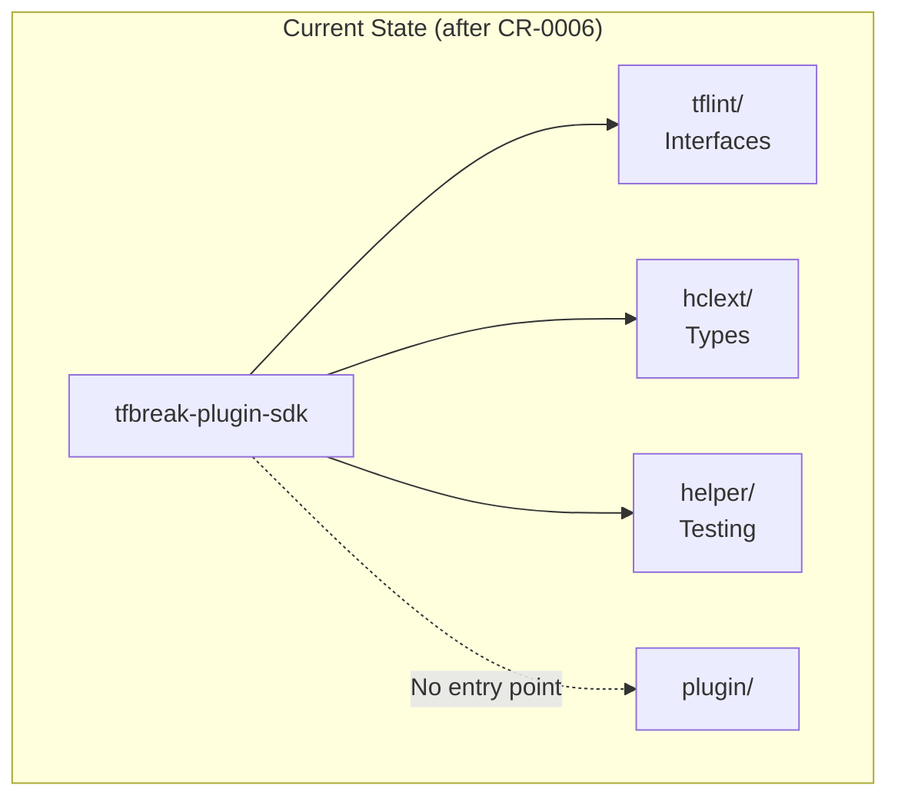
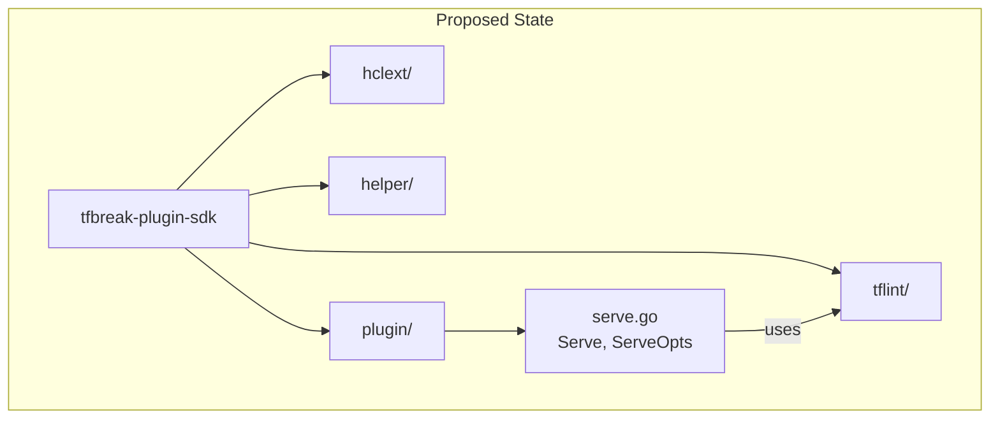

# Plugin Entry Point: Serve Function

## Change Summary

Implement the `plugin` package with the `Serve()` function and `ServeOpts` struct. This is the entry point for plugins, aligning with tflint-plugin-sdk's `plugin.Serve()` pattern. For the MVP, this is a stub implementation that will be extended with gRPC communication in a future CR.

## Motivation and Background

Every tfbreak plugin needs a `main()` function that calls `plugin.Serve()`. This pattern:

1. Aligns with tflint-plugin-sdk's entry point
2. Provides a stable API for plugin authors
3. Enables future gRPC implementation without changing plugin code

For the MVP (v0.1.0), the Serve function is a stub that allows plugins to compile and be built as binaries, but actual host communication is deferred.

## Change Drivers

* Plugins need a main() entry point
* API stability for plugin authors
* Future gRPC integration point
* tflint ecosystem alignment

## Current State

After CR-0006, the SDK has:
- `tflint/` - Complete interfaces and types
- `hclext/` - Schema types
- `helper/` - Testing utilities

No plugin entry point exists.

### Current State Diagram



## Proposed Change

Create the `plugin/` package with:
1. `serve.go` - Serve function and ServeOpts

### Proposed State Diagram



## Requirements

### Functional Requirements

1. The SDK **MUST** provide `type ServeOpts struct` with field: `RuleSet tflint.RuleSet`
2. The SDK **MUST** provide `func Serve(opts *ServeOpts)`
3. Serve **MUST** accept a RuleSet and prepare for host communication
4. For MVP, Serve **MUST** be a stub that does not block (allows binary to exit)
5. Serve **MUST** include GoDoc documenting future gRPC behavior
6. The SDK **MUST** include a comment indicating where gRPC will be added

### Non-Functional Requirements

1. The package **MUST** compile with `go build ./plugin/...`
2. The package **MUST** not introduce additional dependencies for MVP
3. GoDoc **MUST** include usage example

## Affected Components

* `tfbreak-plugin-sdk/plugin/serve.go` - New file

## Scope Boundaries

### In Scope

* ServeOpts struct
* Serve() function (stub)
* GoDoc with usage example

### Out of Scope ("Here, But Not Further")

* gRPC communication - Future CR
* go-plugin integration - Future CR
* Handshake configuration - Future CR
* Protocol buffer definitions - Future CR

## Impact Assessment

### User Impact

Plugin authors can now write complete plugins:

```go
package main

import (
    "github.com/jokarl/tfbreak-plugin-sdk/plugin"
    "github.com/jokarl/tfbreak-plugin-sdk/tflint"
)

func main() {
    plugin.Serve(&plugin.ServeOpts{
        RuleSet: &MyRuleSet{
            tflint.BuiltinRuleSet: tflint.BuiltinRuleSet{
                Name:    "myplugin",
                Version: "0.1.0",
                Rules:   []tflint.Rule{&MyRule{}},
            },
        },
    })
}
```

### Technical Impact

* Completes the SDK package structure
* Provides stable API for future gRPC implementation
* Minimal code footprint for MVP

### Business Impact

* Enables complete plugin development workflow
* Unblocks tfbreak-ruleset-azurerm migration (see tfbreak-ruleset-azurerm CR-0002)

## Implementation Approach

### File: plugin/serve.go

```go
// Package plugin provides the entry point for tfbreak plugins.
//
// Plugins use this package to register their RuleSet with tfbreak-core.
// The Serve function is called from main() and handles all communication
// with the tfbreak host process.
//
// Example plugin main.go:
//
//	package main
//
//	import (
//	    "github.com/jokarl/tfbreak-plugin-sdk/plugin"
//	    "github.com/jokarl/tfbreak-plugin-sdk/tflint"
//	)
//
//	func main() {
//	    plugin.Serve(&plugin.ServeOpts{
//	        RuleSet: &AzurermRuleSet{
//	            BuiltinRuleSet: tflint.BuiltinRuleSet{
//	                Name:    "azurerm",
//	                Version: "0.1.0",
//	                Rules:   rules.Rules,
//	            },
//	        },
//	    })
//	}
package plugin

import "github.com/jokarl/tfbreak-plugin-sdk/tflint"

// ServeOpts contains options for serving the plugin.
type ServeOpts struct {
    // RuleSet is the plugin's rule set implementation.
    RuleSet tflint.RuleSet
}

// Serve starts the plugin server.
//
// This function registers the plugin's RuleSet and handles communication
// with the tfbreak host process. It should be called from the plugin's
// main() function.
//
// Current implementation (v0.1.0):
// This is a stub implementation that allows plugins to be built as
// standalone binaries. The plugin will compile and can be executed,
// but actual host communication is not yet implemented.
//
// Future implementation:
// Will use HashiCorp's go-plugin library with gRPC for communication
// between tfbreak-core and plugins. The API (ServeOpts, Serve) will
// remain stable.
//
// Example:
//
//	func main() {
//	    plugin.Serve(&plugin.ServeOpts{
//	        RuleSet: &MyRuleSet{...},
//	    })
//	}
func Serve(opts *ServeOpts) {
    if opts == nil || opts.RuleSet == nil {
        // Nothing to serve
        return
    }

    // TODO(gRPC): Implement actual plugin serving with go-plugin.
    //
    // Future implementation will:
    // 1. Set up gRPC server with RuleSet service
    // 2. Configure handshake with tfbreak-core
    // 3. Block until host disconnects
    //
    // For now, this stub allows plugins to be built and the main()
    // function to complete. When invoked directly (not via tfbreak),
    // the plugin simply exits.

    // Validate the RuleSet is usable (fail fast on misconfiguration)
    _ = opts.RuleSet.RuleSetName()
    _ = opts.RuleSet.RuleSetVersion()
    _ = opts.RuleSet.RuleNames()
}
```

## Test Strategy

### Tests to Add

| Test File | Test Name | Description | Inputs | Expected Output |
|-----------|-----------|-------------|--------|-----------------|
| `plugin/serve_test.go` | `TestServe_NilOpts` | Verify nil handling | nil | No panic |
| `plugin/serve_test.go` | `TestServe_NilRuleSet` | Verify nil RuleSet | &ServeOpts{nil} | No panic |
| `plugin/serve_test.go` | `TestServe_ValidRuleSet` | Verify valid RuleSet | Valid RuleSet | No panic, returns |

Note: Actual behavior tests will be added when gRPC is implemented.

### Tests to Modify

Not applicable.

### Tests to Remove

Not applicable.

## Acceptance Criteria

### AC-1: ServeOpts accepts RuleSet

```gherkin
Given a ServeOpts with a RuleSet
When inspected
Then the RuleSet field contains the provided RuleSet
```

### AC-2: Serve handles nil gracefully

```gherkin
Given nil opts
When Serve(nil) is called
Then no panic occurs
  And the function returns immediately
```

### AC-3: Serve accepts valid RuleSet

```gherkin
Given a valid RuleSet
When Serve(&ServeOpts{RuleSet: rs}) is called
Then no panic occurs
  And the function returns (stub behavior)
```

### AC-4: Plugin can be built

```gherkin
Given a plugin main.go that calls plugin.Serve
When go build is executed
Then the plugin compiles successfully
  And produces an executable binary
```

## Quality Standards Compliance

### Verification Commands

```bash
# Build verification
go build ./plugin/...

# Lint verification
go vet ./plugin/...

# Test execution
go test -race -v ./plugin/...
```

## Risks and Mitigation

### Risk 1: API changes when adding gRPC

**Likelihood:** Low
**Impact:** High
**Mitigation:** ServeOpts and Serve() signature designed to remain stable; only internal implementation changes

## Dependencies

* CR-0005 - tflint.RuleSet interface

## Estimated Effort

| Task | Effort |
|------|--------|
| serve.go implementation | 15 minutes |
| serve_test.go | 15 minutes |
| Documentation | 10 minutes |
| **Total** | **~40 minutes** |

## Decision Outcome

Chosen approach: "Stub Serve function with stable API", because it enables plugin development now while providing a clear extension point for future gRPC implementation.

## Related Items

* Architecture decisions: ADR-0001-tflint-aligned-plugin-sdk.md
* Parent CR: CR-0001-minimum-viable-sdk.md
* Previous CRs: CR-0002 through CR-0006
* Consumer CR: tfbreak-ruleset-azurerm/docs/cr/CR-0002-sdk-migration.md
* Future CR: gRPC implementation (not yet created)
